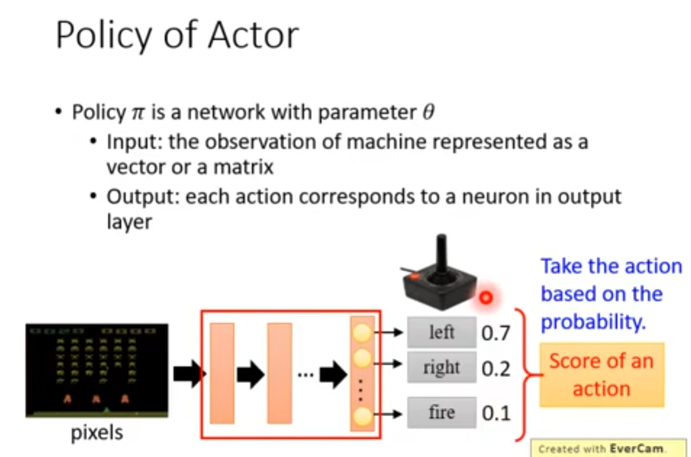
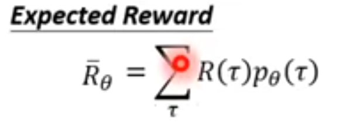
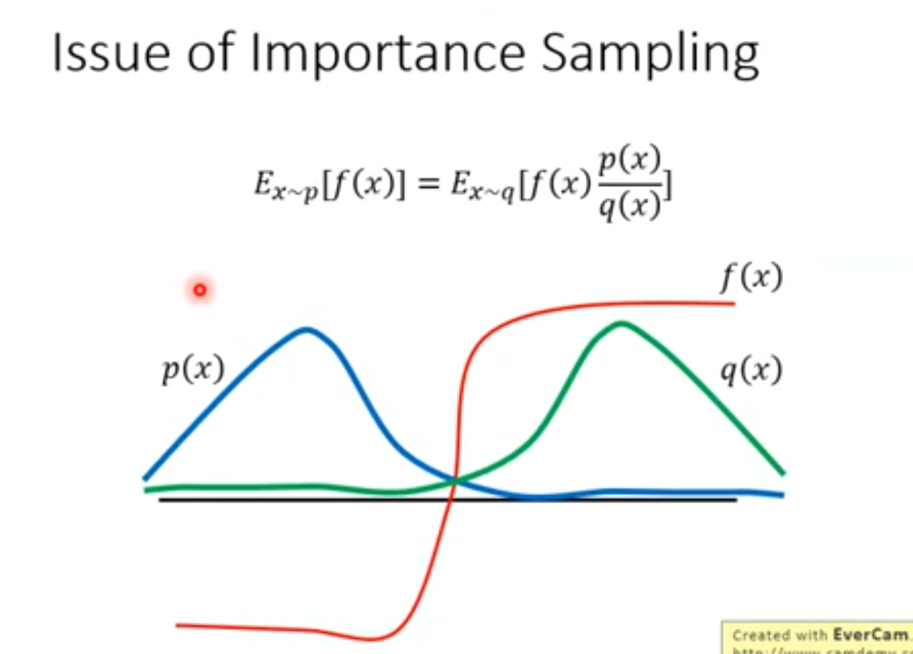

# 1.前置知识

$p_{\theta}(\tau)$代表在Actor的网络参数为$\theta$的情况下，产生的Trajectory为$\tau$的概率
$$
\begin{align}
p_{\theta}(\tau)=
\\& Environment输出s_1的几率\cdot 
\\&Actor参数为\theta的网络 根据s_1输出a_1的几率（根据network描述的action的distribution决定）\cdot 
\\&Environment根据给定action\ a_1 以及上一次的状态s_1生成s_2的概率（可能环境是固定的生成某一个s_2，那这种情况就能找到一条固定path达成目标）
\\&...
\end{align}
$$

在trajectory $\tau$得到total reward

==我们要做的事情就是调整Actor内部参数$\theta$让total reward最大==

注意这个total reward是个random variable，因为无论是得到action还是得到下一个state都是有随机性的，所以我们能够计算的是给定某个参数$\theta$的情况下其期望，算法为穷尽每一个trajectory算期望

以后我们写成==$E_{\tau\sim p_{\theta}(\tau)}[R(\tau)]$==，读作从$\theta$分布的Actor中选取trajectory $\tau$并计算trajectory $\tau$的total reward的期望

# 2.Maximize Trajectory Reward-Gradient Descend

Gradient decent

实际上这个Expectation是算不出来的，所以我们只能用采样的方式采样N个trajectory来近似这个Expectation，然后你就能update你的gradient然后update你的参数然后update你的policy。==这里有个很有意思的一点是采样的期望是不需要乘上概率的，因为采样本身就是暗含了它的分布，所以我们只需要求其均值就行了==

之前我们说过$p_{\theta}(\tau)$是可以算的，它的概率主要来自两个部分，一个是Actor一个是Environment，Env那一项做gradient是没有用的，因为和theta没用，真正做gradient其实只有$(a^n_t|s^n_t)$

其实对于最后这个式子来直观的看的话，就是Actor的(st,at)对 对Reward是一个正向的激励还是一个负激励，正激励是我们需要的，负激励是我们要调整对应参数让它选择其他action的

# 3.实做

搜集一大堆s，a的pair，以及其reward（拿agent去跟环境互动，互动完就得到一堆游戏记录，然后从这一对pair中选N个扔到右边去得到gradient，gradient的weight就是==这场游戏的reward==（而不是这一步的reward）

然后用$\eta$的步长去更新$\theta$，然后重新搜集s,a pair，这样迭代

我们有时也用Loss $L(\theta)=\frac{1}{N}\sum^N_{n=1}\sum^{T_n}_{t=1}logp_{\theta}(a^n_t|s^n_t)$，而$R(\tau)$就相当于对loss的一个加权

# 4.Tips1

Reward可能总是正的，因此可能训练下来说所有动作的几率/评价都拉高，但是他们拉高的weight有大有小，上升的少的做完normolize之后会下降，因此不碍事

因为我们是Sampling pair，所以某些action会没有sample到，而因为reward所有都是正的，==所以某些action会在其他action几率上升时，normolize后几率下降，因此我们希望reward有正有负，即假如baseline b，让reward有正有负==，最简单的做法我们可以用$\tau$的reward的expectation作为b来用

# 5.Tips2

我们应该给每一个action一个合适的credit！

因为我们对每一个$(a^n,s^n)$，所乘上的权重$R(\tau^n)-b$是这个trajectory所有action的功劳，一个高的权重并不代表这个action就是好的，一个低的权重不代表这个action就是坏的，所以我们希望对每一个不同的action乘上一个不同的weight，理论上sample过多就能解决这个问题，因为你讨论了各种情况，整体分布还是会拉高对某个action的评价

该怎么做呢？明显的，左边整场游戏reward是3分。a2a3都是垃圾

因此，我们可以将这个乘上去的权重变为==从这个action开始，一直到trajectory完成的得到的分数==

更进一步，==我们把比较未来的reward做一个discount==，因为越往后的action不应该具有一样的权重，$\gamma$一般取0.9

同样的，==这个b也可以是state dependent，由network生成出来==

我们通常称这个权重为Advantage Function$A^{\theta}(s_t,a_t)$

这个函数的意义就是我们在某一个state st 执行某一个action at，相较于其他action （减去一个baseline）他有多好，同样这个A也可以是由network estimate出来的，称为==credit==

# 6.PPO

On-policy: Agent learn and the agent interacting with the environment

​					sample->update->sample->...非常花时间

Off-policy: Agent learn and the other agent interacting with the env

​					用固定的$\theta'$训练$\theta$

Off-policy的sample影响更大，所以引入importance sampling

 $E_{x\sim p}[f(x)]$从distribution p里面sample一个x，求f(x)的expectation，==但是我们只有从q里面sample的数据==，因此我们利用Importance Sampling可以利用q的数据得到p的期望，（又称为给q里面sample的data乘上一个weight进行修正）

==p 和 q不能差太多，不然会有问题==

可以看出来，当p和q差别很大的时候，他们的方差会相差很大，并且sample的行为会放大这种差异

## on policy to off policy

我们假设有另外一个$\theta‘$，他的工作是做demonstration，他要示范给你看，只负责跟环境做互动，因此这个$\tau$是从$\theta'$smaple出来的

==但是这我每次更新那个真的$\theta$，最终都会导致他俩的差异，所以我们就应用important sampling，从$\theta'$取policy$\tau$，然后利用$\theta$取得$\tau$的概率与$\theta'$取得$\tau$的概率对这个东西做一个修正，从而求得$\theta$的期望==

因此我们应用到Gradient上

有几个点

* Advantage应该用$\theta'$的
* 我们认为这个$\theta$和$\theta'$在state st下的几率是差不多的，因为他面对的action是一样的，退一步说，这个几率我们也算不出来

所以现在，我们得到了一个新的objective function，下图是之前的objective function

可以做个对比，其实Gradient和原函数就差了个log的梯度，因此我们将log梯度去掉就是原函数了

$J^{\theta'}(\theta)$代表我们拿$\theta'$做demonstration，来优化$\theta$

但是我们$\theta$和$\theta'$不能差太多，如何把控这个度就是PPO的功能

## PPO

为了两者不差太多，我们加入一个修正

这个KL散度保证了我们最后learn出来的$\theta$不会和$\theta'$太不一样

提一嘴，PPO前身TRPO的constraint是一样的，但是这个constraint是很难处理的，而不是放在objective里面，PPO和TRPO performance可能差不多，但是实现难度不一样。

## KL divergence

值得注意的是，这个$KL(\theta,\theta')$并不是将$\theta$和$\theta'$当作两个参数来直接计算散度，不是计算他们参数上的距离，而是计算他们在Actor中output的这么一个distribution的距离，即为behavior distant（给同样的state时候，输出action的distribution的KL divergence）

## PPO1 algorithm

* $\theta k$：前一个iteration的参数
* KLmax和KLmin是你自己设定的能接受的范围

这个KL的$\theta$和$\theta'$ 是通过已经sample来的这些数据算出来的

如果不想算KL divergence可以使用PPO2

## PPO2

clip(a,b,c):if a < b return b if a > c return c

 这个min只有两种形态

Advantage>0时，说明这一个pair是好的，我们希望ptheta越大越好

虽然希望越大越好，但是ptheta/pthetak我们限制他最多只能训练到1+epsilon倍，超过1+epsilon就没有benefit了，防止差异过大

如果过小，则我们目标是让其越大越好，所有随着训练可以让他慢慢挪大

Advantage<0时，同理，压小，但不是很小