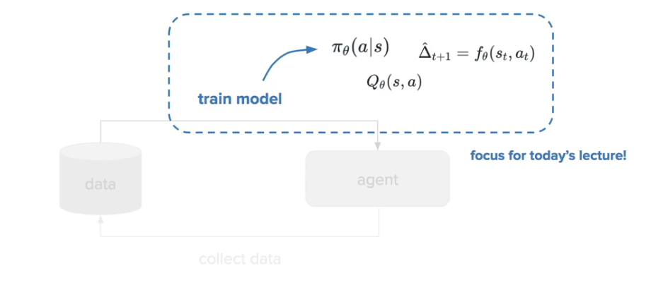
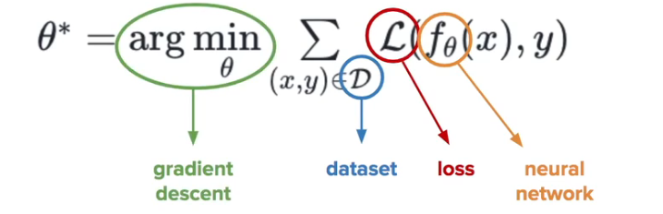
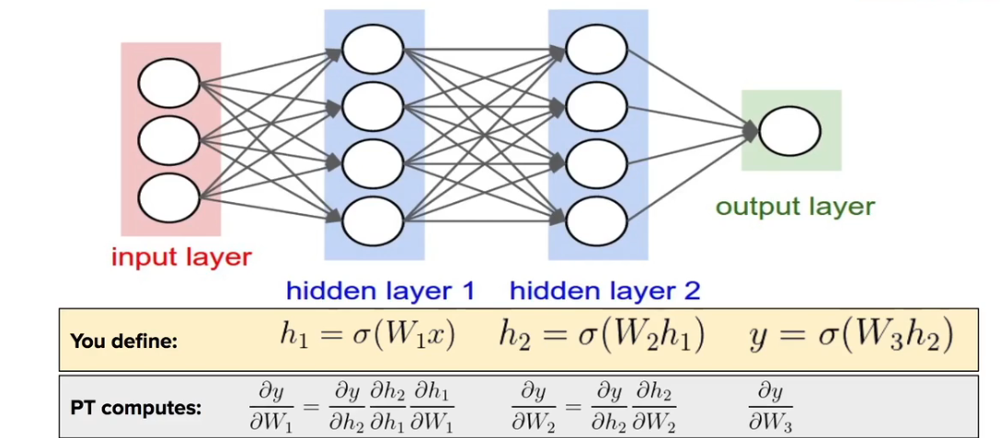

## Introduction to optimization model

一个RL的模型基本上包括训练的模型Agent与可交互的环境Data。本章主要目的就是介绍如何训练一个模型。

**How do we train a model**

上图展示了一个一般的优化模型，你拥有Dataset，neural network，loss function，以及一个用来优化的算法，一般为梯度下降。

**How pytorch work**

上图展示了一个两个隐藏层的前向反向传播过程。

具体教程见ipynb

