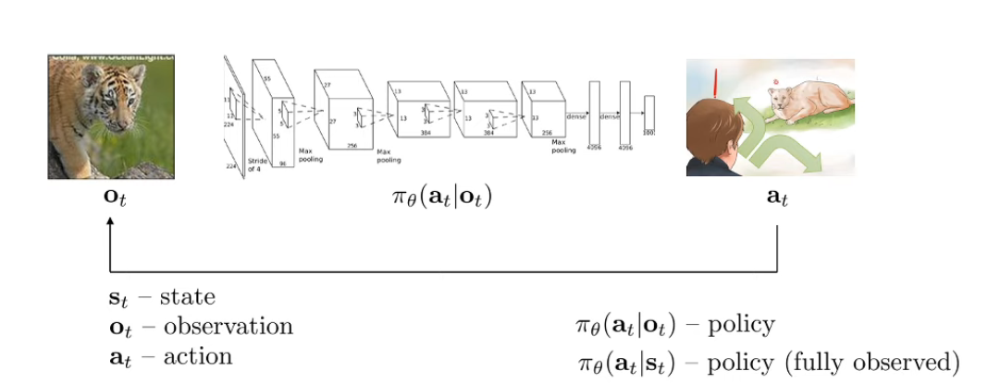
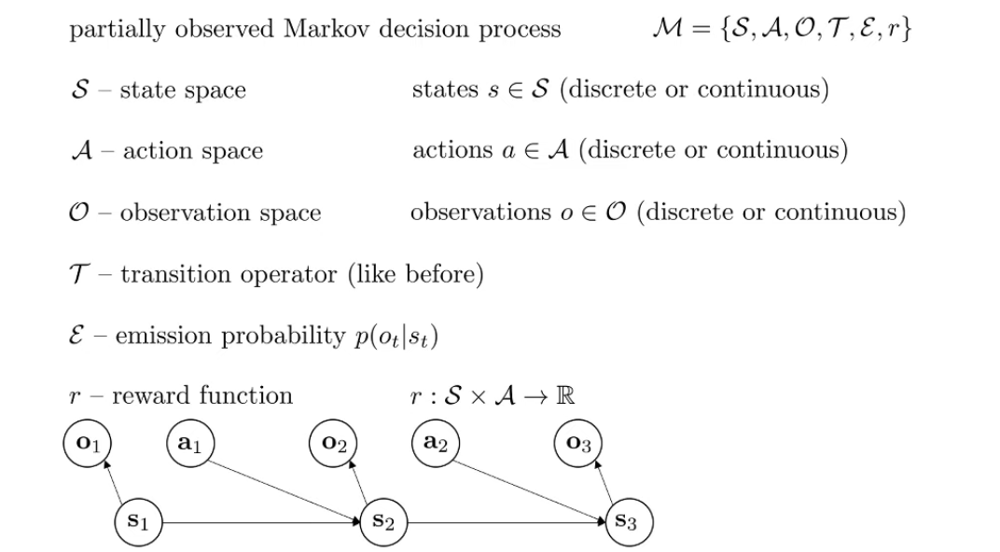
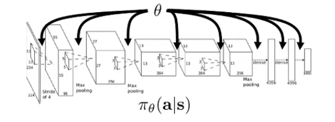
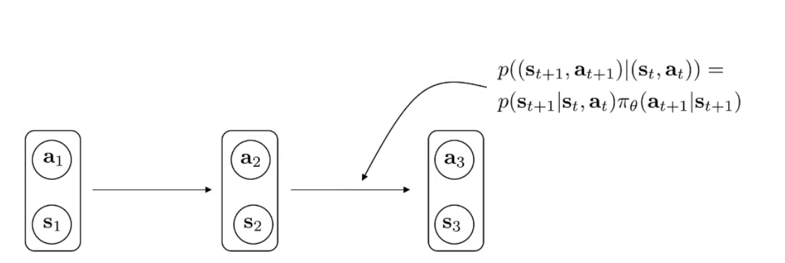

## RL模型概述

在之前的Imitation learning中，我们了解到，我们可以将policy看作一个分布，这个分布决定了在obserbation $o_t$下采取动作$a_t$的分布。我们称这个policy为$\pi$，并且常常使用下标$\theta$来表示这个策略被我们使用参数$\theta$来构造。在DeepRL中，这个$\theta$​通常就代表了不同的网络参数。

需要再次声明的是，observation $o_t$和state $s_t$在很多情况下是等价的。连接observation和action的边就是policy。连接当前状态和下一个状态的就是转移概率(transition probability), 通常假设state满足马尔可夫性质，这意味着状态在时间 $t+1$时的情况只依赖于当前的状态 $s_t$，与前一个状态 $s_{t-1}$ 无关。在马尔可夫性质下，只要知道当前状态 $s_t$​，就可以对未来的状态进行预测，而不用关心之前的任何状态。

在之后，具体能分为两类算法：Fully observed case代表你能够知晓完全的state，而partial ovserved case 代表你只拥有$o_t$。

在Imitation Leaning中，我们根据专家策略来训练我们的策略

在强化学习中，我们能够不使用专家策略而训练我们自己的策略。

具体来说，在Imitation learning中，我们认为专家策略是一个“好的”行动，换句话说，只要我们能判断一个行动的好坏，我们并不需要专家策略。

强化学习提出了Reward funciton  $r(s,a)$​来作为目标函数，他告诉我们哪些状态使用哪些动作更好或者更坏。注意最终的目标不是当前动作的高价值，而是当前动作能否导向一个高价值。

至此，强化学习的主要元素都已经介绍了

$state: s$

$action: a$

$reward: r(s,a)$

$transition\ probability: p(s'|s,a)$

使用这些就能构建一个马尔可夫决策过程 markov decision process

## Markov decision process

### 马尔科夫背景下状态的表示方式

在马尔可夫链或马尔可夫过程的背景下，当前时间步的状态的确是已知的。这引出两种不同的状态表示方式：**单一状态表示**和**概率分布表示**。

 **单一状态表示**

在最简单的情形下，当前时间步的状态可以被确定为某个具体的状态。例如，在一个状态空间 {𝐴,𝐵,𝐶,𝐷}{*A*,*B*,*C*,*D*} 中，当前状态可以是状态 𝐴*A* 或者状态 𝐶*C* 等。在这种情况下，当前状态是已知的，不需要一个完整的状态向量。

然而，这种表示方式适用于只需要关注当前状态，并且没有不确定性或随机性的情况。

**概率分布表示**

在更复杂的情形中，我们希望用概率分布来表示系统的状态：

1. **部分可观察性**：
   - 在一些问题中，当前状态可能无法直接观察到，或者只有部分观察数据。我们只能通过观察到的数据对当前状态进行估计和推断。在这种情况下，当前的状态不再是一个已知的具体值，而是一个概率分布。
2. **状态转移概率**：
   - 在模型中，未来状态与当前状态之间的转移是概率性的。因此，当前时间步的状态也通常用概率分布来表示。
3. **预测和分析**：
   - 使用概率分布可以分析状态的变化趋势，并预测未来时刻的状态分布。

在一个具有随机性或不确定性的系统中，状态可以通过状态向量的概率分布进行描述，以表示当前状态空间中各个状态的可能性。概率分布表示可以覆盖单一状态表示。实际上，单一状态表示可以被视为概率分布表示的一种特殊情况。

### Markov Chain

马尔可夫链可以被表述为一个由状态和状态转移概率组成的集合

$\mathcal{M} = \{\mathcal{S},\mathcal{T}\}$

其中

$\mathcal{S}$代表状态空间，states $s\in \mathcal{S}$,状态空间可以是离散的或是连续的。

$\mathcal{T}$代表转移概率，$p(s_{t+1}|s_t)$，它代表了当前状态转移到下一个状态的概率。

通常来说我们会认为$\mathcal{T}$​​为 transition operator。

这是因为，考虑我们的状态集$\mathcal{S}$一共有n个状态。概率分布表示的状态中，每个时间步需要一个概率分布来描述每个状态的可能概率。因此每个时间步也需要用一个$n$维的向量来描述。

我们使用$\mu_{t,i}$代表时间步t上第i个状态的概率。那么整个状态向量就被称为$\vec{\mu_t}$

考虑$\vec{\mu_t}$上的k个状态都需要发生转移（转移到大小为n的状态集的另一个），因此，我们就可以将Transition Probability写作一个矩阵$\mathcal{T}$，其中的$\mathcal{T}_{i,j}$代表如果当前状态为$j\in\mathcal{S} $，转移向$i\in\mathcal{S}$​的概率。
$$
\mathcal{T}_{i,j} = (s_{t+1}=i|s_t  = j)
$$

因此，状态转移就可以被简写为
$$
\vec{\mu}_{t+1} = \mathcal{T}\vec{\mu}_t
$$

==Markov Chain本身不能作为我们决策链的基础，因为它没有考虑Actions，只是考虑了状态自发的转移==

### Markov Decision Process

#### 1. Basic Markov decision process

Markov Decision Process被描述为如下它增加了一个动作空间和一个奖励函数。
$$
\mathcal{M} = \{\mathcal{S},\mathcal{A},\mathcal{T},\mathcal{r}\}
$$
$\mathcal{S}-state\ space$

$\mathcal{A}-action\ space$​

$\mathcal{r}:\mathcal{S}\times\mathcal{A}\rightarrow \mathbb{R}-reward\ function$​

通常通过$r(s_t,a_t)$​获得当前reward。

$\mathcal{T}-transition\ operator\ (now\ a\ tensor)$

Markov decision Process的状态转移算子也变为了同时与State和Action有关。

> 注意，Transition operator已经变成了一个tensor而非Matrix，因为他有三个维度（next state, current state, current action)

我们仍然可以得到类似的算子解释

$\mu_{t,j} = p(s_t = j)$， $\mu_{t,j}$表示时间步$t$上各个状态的概率分布。维度为$|\mathcal{S}|$，即为状态空间的大小。

$\xi_{t,k} = p(a_t=k)$， $\xi_{t,k}$表示时间步$t$上各个动作的概率分布。维度为$|\mathcal{A}|$，即动作空间的大小。

$\mathcal{T}_{i,j,k} = p(s_{t+1}=i|s_t=j,a_t=k)$​

你可以理解为它拥有$|\mathcal{S}|\times |\mathcal{S}|$个空间，每个空间可以采取$|\mathcal{A}|$个动作，即为每个动作在某一个状态下都有一定概率使得当前状态转向另一个状态。

$\mathcal{T}_{i,j,k}$代表**当前状态$j$采取动作$k$转移到下一个状态为$i$的概率**

下一个时间步的状态可以由$\mu_{t+1,i} = \sum_{j,k}{\mathcal{T}_{i,j,k}\mu_{t,j}\xi_{t,k}}$得到。

其中$i$是目标状态索引，$j$是当前状态索引，$k$​代表动作索引。

#### 2. 基于tensor乘的状态转移写法

我们尝试使用Tensor乘法来表示以上的状态转移过程。

$[|\mathcal{S}|,1,|\mathcal{S}|] \times[|\mathcal{S}|,|\mathcal{S}|,|\mathcal{A}|]\rightarrow [|\mathcal{S}|,1,|\mathcal{A}|] $

$[|\mathcal{S}|,1,|\mathcal{A}|] \times [|\mathcal{S}|,|\mathcal{A}|,1]\rightarrow [|\mathcal{S}|]$

对于第一个Tensor乘，其对$|\mathcal{S}|$个$1\times|\mathcal{S}|$和$|\mathcal{S}|\times|\mathcal{A}|$矩阵乘算，相当于$|\mathcal{S}|$个
$$
\mu^p_{t+1,i} = \sum_j\mu_{t,j}\cdot \mathcal{T}_{i,j,k}
$$
其中$\mu^p_{t+1,i}$的维度为$1\times|\mathcal{A}|$​，代表下一个状态向量的第i个状态的中间变量

对于第二个Tensor乘,其对$|\mathcal{S}|$个$1\times|\mathcal{A}|$和$|\mathcal{A}\times 1|$矩阵乘算，相当于$|\mathcal{S}|$​个
$$
\mu_{t+1,i} = \sum_k \mu^p_{t+1,i,k} \cdot \xi_k
$$
$\mu_{t+1,i} $​代表下一个状态向量的第i个状态。

上面的方式展开就是
$$
\mu_{t+1,i} = \sum_k \mu^p_{t+1,i,k} \cdot \xi_k=\sum_k\xi_k\cdot\sum_j\mu_{t,j}\cdot \mathcal{T}_{i,j,k}
$$
写为tensor 乘法就是
$$
\mu_{t+1,i} = \mu_t \times \mathcal{T} \times \xi_t
$$
当然需要考虑broadcast。

#### 3. Partially observed Markov decision process

虽然Basic Markov decision process 也会考虑到环境不能完全可知，从而使用概率分布建模，但是仍然会为Partially observed Markov decision process准备更准确地定义。

其中新增加了观测函数$\varepsilon$，用于表示在给定当前状态的情况下观测数据的概率。

#### 4. Objective of RL

我们的训练对象是策略$\pi_\theta$，其中$\theta$是网络参数，因此也可以说我们的训练对象是$\theta$

state进入policy，获得一个action，state和action通过一个environment的模拟获得下一个state。

定义Trajectory（轨迹）为一个状态动作序列，根据Trajectory的长度又可以分为**Finite Horizon**和**Infinite horizon**

##### **Finite Horizon**

**Finite Horizon：**决策任务持续固定的时间步长，记为$T$​

对于Finite Horizon，我们可以写下我们的状态行动联合分布(joint distribution of states and actions)如下

此处的$p_\theta$代表该联合分布依赖于策略$\pi_\theta$,$p(s_1)$代表初始状态概率分布，后面乘上一个链式的概率。

> 注意，理论上chain rule probability需要你的条件概率包含以前所有的状态（或者状态动作对），但是此处使用马尔可夫性质来消除了依赖。

这个联合概率我们后面记为$p_\theta(\tau)$,其中$\tau$​代表Trajectory。

进一步的，我们可以设置目标为轨迹下的最大期望值(trajectory $\tau$ similar to joint distribution)
$$
\theta^* =\arg \max_\theta{E_{\tau\sim p_\theta(\tau)}[\sum_t r(s_t,a_t)]}
$$
目标是最大化Trajectory的奖励期望。

​	

##### **Infinite Horizon**

对于Finite Horizon中的Objective function，我们可以一个新的理解角度来推广到Infinite Horizon。

考虑将$(a_t,s_t)$​打包成为一个增强的状态，那么实际上MDP就可以看作是一个Markov chain。

此时，我们可以说，对于Finite Horizon，我们的期望实际上是有限的T步中，所有步的抉择的期望和。
$$
\theta^* = \arg \max_\theta\sum^T_{t=1}E_{(s_t,a_t)\sim p_\theta(s_t,a_t)}[r(s_t,a_t)]
$$
此时我们可以称目标为最大化有限步数内的总期望。

###### MDP的平稳分布理论

> 平稳分布可以在应用随机过程中学习，平稳分布可以看作联合概率分布的边缘分布

基于这个转换，我们能够以每一步的视角来评判当前策略的质量。

首先，未来k步的状态实际可以表示为$(s_{t+k},a_{t+k})=\mathcal{T}^k(s_t,a_t)$

我们用$\mu_t$来表示状态动作对的概率分布,可以记为$p(s_t,a_t)$

在无限的时间步中，我们会期望$\mu_t$能够收敛到一个**平稳分布**（stationary distribution）。
$$
\mu_{t+1} == \mathcal{T} \mu_t
$$
平稳分布是一种概率分布，当系统在此分布下运行时，无论经过多少次状态转移，系统的分布都保持不变。

在特定条件下（如遍历性和非周期性），马尔可夫链可以保证从任何初始分布开始，经过足够长的时间都会收敛到平稳分布。

- 在满足某些条件（如遍历性和非周期性）下，平稳分布是一定存在的。
  - **遍历性**：每个状态都可以通过非零概率从其他任何状态到达。
  - **非周期性**：马尔可夫链不会遵循严格的周期模式。

**遍历性的重要性**：

- 没有遍历性的话，可能会出现从MDP的某个部分无法到达另一个部分的情况，从而使平稳分布不存在。
- 遍历性确保最终可以通过微小的概率从任何一个状态到达另一个状态。

**平稳分布方程**：

* 我们称符合$\mu_{t+1} == \mathcal{T} \mu_t$的$\mu$为平稳分布。

- 平稳分布 *μ* 满足方程 $(T−I)μ=0$，其中 $𝐼$是单位矩阵。
- 因此，*μ* 应该是转移矩阵 $\mathcal{T}$​​ 的特征向量，其特征值为1，并且在遍历性和非周期性假设下总是存在。
- 平稳分布是转移矩阵的特征向量，其特征值为1。**因此它是马尔可夫链的固定点或吸引点，其他状态会逐渐收敛到这个固定点。**

**平稳分布的意义**：

- 如果马尔可夫链运行足够长的时间，它最终会稳定在平稳分布 *μ* 中。
- 当 *T* 趋于无穷大时，期望和将主要由平稳分布中的项所主导。

因此，在强化学习中，平稳分布的存在性确保了长期目标的可预测性和一致性：

- **长期奖励评估**：平稳分布让我们可以计算在长期情况下的平均奖励或累积奖励。
- **策略的效果**：通过假设长期分布收敛，我们可以评估不同策略的长期效果。

即为，满足了如下的条件
$$
\theta^* = \arg \max_\theta \frac{1}{T}\sum^T_{t=1}E_{(s_t,a_t)\sim p_\theta(s_t,a_t)}[r(s_t,a_t)]\rightarrow E_{(s,a)\sim p_\theta(s,a)}[r(s,a)]
$$

$$
T\rightarrow \infty
$$

##### 总结

Reinforcement Learning is really about EXPECTATIONS

因此尽管我们很关心如何选择高回报率的行动，我们最关心的其实是奖励的期望值。

期望的一个有趣的性质就是**期望值可以在对应分布的参数上连续变化，即使我们计算期望的目标函数本身高度不连续。**

> EXPLANATION：
>
> 期望值表示的是一个随机变量在概率分布上的平均值。假设 $X$ 是一个随机变量，$f(X)$是一个函数，那么 $f(X)$​的期望值通常定义为：
> $$
> E[f(X)] = \int f(x)p(x)dx
> $$
> 这里的$p(x)$是随机变量$X$的概率密度函数，X代表随机变量（可以是离散的，遵循某种概率分布），x代表是一个具体值，你可以看成从X的一次sample。
>
> 这句话的意思就是，尽管$f(X)$可能就具有高度离散型，它的期望值在概率分布的参数上应该是连续的
>
> 例如设想目标函数 $f(x)$是一个阶跃函数，只返回0或1。这个函数在特定位置有一个显著的跳变（不连续）。
>
> 假设我们要计算阶跃函数在正态分布上的期望值。随着正态分布的均值或方差参数连续变化，期望值的变化是平滑的，因为分布本身的平滑性能够消除$f(x)$​​的不连续性。
>
> 很大部分是概率密度函数的连续性平滑了目标的离散性
>
> 

这个性质使得RL可以使用平滑的梯度下降法来优化目标。

具体来说，对于自动驾驶的例子，车的位置和左转右转的离散命令带来的Reward本身是没有梯度下降的意义的，但是使用期望之后就有了。

