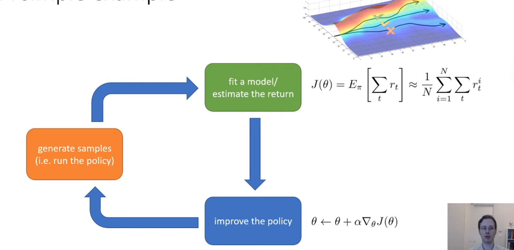
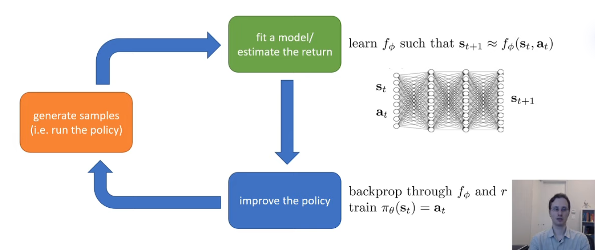
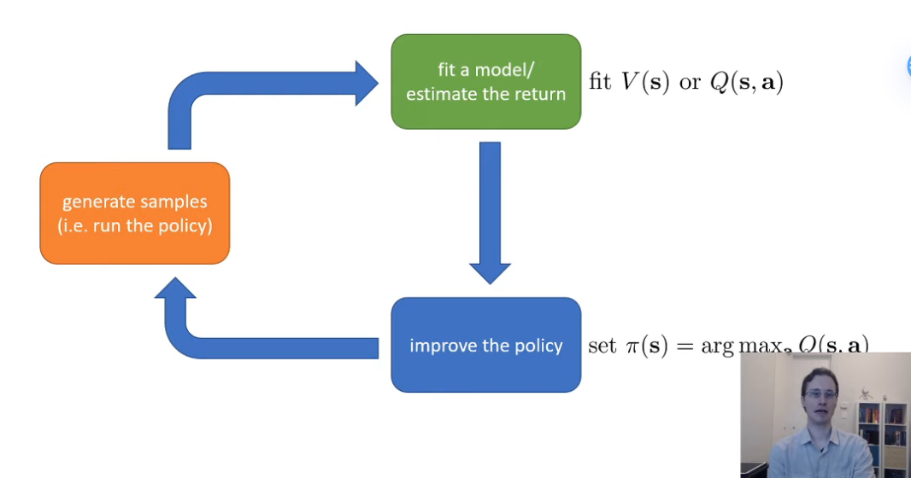
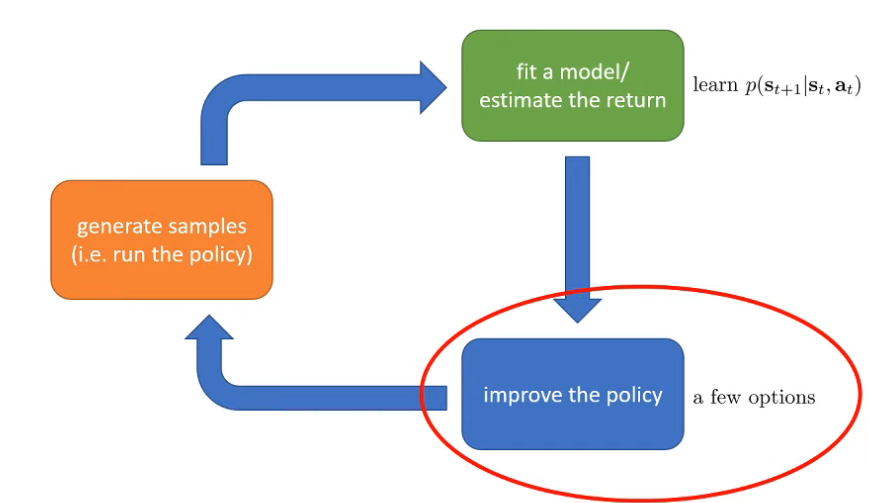
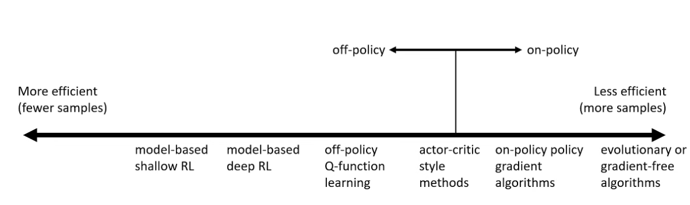

## 1. **Overall framework**

### Train Model-Free RL: Policy gradient algorithm

==Model Free 直接从环境反馈中学习策略，不依赖于对环境动态的显式建模。==

==换句话说，它仅使用真实环境中获得的“优质数据”进行学习==

无模型的方法，如PPO，不依赖于对环境的模型，而是通过与环境的实际交互来学习策略。这种方法直接**从经验中学习策略和/或价值函数**，通常需要大量的交互来有效地学习，因为它们无法通过模拟来预见未来的状态和奖励。

例如下面的橙色框，就是代表和现实世界的交互。

橙色框： 从环境中抽样多个Trajectory

绿色框： 总结轨迹的奖励，告诉policy当前你的policy有多好

蓝色框：计算奖励的梯度

这是一个简单的Trial and Error Style

* Run your policy
* get some trajectories
* measure how good those trajectories are
* modify the policy to make the better trajectories have a higher probability
  * 以上面右图来说，我们通过梯度下降的方法，让打X的轨迹（认为是较坏的轨迹）变得less likely，而绿色√的轨迹（认为是较好的轨迹），变得More likely，从概率图上也能看出，那附近的轨迹概率更高

### Train Model based RL by backprop

==Model Based 首先尝试构建一个环境的模型，然后使用这个模型来做出决策或改进策略。==

==换句话说，使用优质数据生成虚拟数据，因此这个方法的效果完全取决于模型的精确度。在模型训练完成之后，==

(1) ==可以像Model Free一样训练策略，因为有大量的数据交互，因此学习更快。==

(2) ==可以使用蒙特卡洛树搜索或者其他高级规划算法来获得给定状态的最优或者近似最优动作序列。**这个序列既可以直接使用，也可以作为Imitation Learning的导向。**==

> ### 1. **样本收集和模型训练**
>
> 首先，算法从实际环境中通过与之交互收集数据。这些数据包括状态（s）、动作（a）、结果状态（s'）和奖励（r）。这些实际获得的数据点被用来训练或改进一个环境模型，这个模型的目的是预测给定当前状态和动作时的下一个状态和奖励。
>
> ### 2. **模型的应用和虚拟样本生成**
>
> 一旦模型被训练或校准，它就可以被用来模拟环境。这意味着模型可以生成大量的虚拟交互数据，而不需要实际在物理或复杂的环境中进行操作。例如，你可以向模型查询特定状态和动作的组合，并获取预测的下一个状态和奖励。
>
> ### 3. **策略和价值函数学习**
>
> 这些由模型生成的虚拟数据可以用来训练或完善策略（决定在每个状态下采取什么动作）和价值函数（评估状态或动作的好坏）。因为这些数据是基于模型生成的，所以可以在没有额外实际交互成本的情况下大量生成，从而大幅度增加了学习过程中可用的数据量。
>
> ### 4. **反馈循环**
>
> 此外，通过实际环境的进一步交互获得的新样本可以用来再次更新和改进模型，使得模型更加精确和可靠。这样，每个新的真实样本都有可能通过改进模型来间接增加大量有效的学习数据，从而创建一个正向的反馈循环，提高整体学习效率。

因此，下面的绿色框中，模型就变成了整个环境的一个状态转移的描述（或者说决策分布）。

在上图中，是一个框架的扩展，这里我们训练的目标从trajectory变成了模拟模型（或者称为一个决策分布$\phi$

我们通过反向传播来提升让这个策略分布下，$\pi_\theta(s_t) = a_t$

### 区别

#### 基于模型的RL的优势和局限：

1. **优势**：
   - **高效的样本使用**：由于有模型的预测能力，基于模型的方法可以通过模拟而非实际交互来进行学习，减少了对真实环境样本的需求。
   - **更好的规划能力**：模型可以用于规划，即计算最优策略，特别是在决策树和路径规划问题中非常有效。
2. **局限**：
   - **模型的准确性**：模型的有效性极大依赖于其准确性。如果模型无法准确预测环境反应，那么基于此模型的决策可能会导致性能不佳。
   - **复杂性和计算成本**：开发和维护一个精确的环境模型可能既复杂又耗时，特别是在环境动态性较大的情况下。

#### 无模型的RL的优势和局限：

1. **优势**：
   - **灵活性和通用性**：无模型方法不依赖于外部模型，使得它们在未知或复杂环境中更加灵活和适应。
   - **简单性**：通常来说，无模型方法的实现较为简单直接，因为它们不需要构建和维护一个环境模型。
2. **局限**：
   - **样本效率低**：这类方法通常需要大量与环境的交互来学习有效策略，这在实际应用中可能是一个限制因素，特别是在交互成本高的场景下。
   - **收敛速度**：无模型的方法可能需要更多的迭代才能达到稳定和高效的策略，特别是在复杂的任务中。

## **2. 数学角度看Value Functions**

这里可以用概率链式法则展开这个期望，首先将每一个基础状态$(s_t,a_t)$对展开为一个基于状态转移概率的状态$s_1\sim p(s_1)$以及一个基于当前策略的当前状态的动作概率 $a_1 \sim \pi{(a_1|s_1)}$

然后因为马尔可夫假设，后续在发生概率转移时仅需要计算基于上一个状态的条件概率$s_2\sim p(s_2|s_1,a_1)$。
$$
E_{\tau\sim p_\theta(\tau)}[\sum^T_{t=1} r(s_t,a_t)] = E_{s_1\sim p(s_1)}[E_{a_1 \sim \pi{(a_1|s_1)}}[r(s_1,a_1) + 
\\
\color{red}E_{s_2\sim p(s_2|s_1,a_1)}[E_{a_2 \sim \pi{(a_2|s_2)}}[r(s_2,a_2) + 
\\
\color{blue}E_{s_3\sim p(s_3|s_2,a_2}[E_{a_3 \sim \pi{(a_3|s_3)}}[r(s_3,a_3)+...|s_3
\color{blue}]|(s_1,a_2)]
\color{red}|s_2]|(s_1,a_1)]
\color{black}|s_1]]
$$

那么实际上，我们可以将

$r(s_1,a_1) + \color{red}E_{s_2\sim p(s_2|s_1,a_1)}[E_{a_2 \sim \pi{(a_2|s_2)}}[r(s_2,a_2)+...|s_2]|(s_1,a_1)]$

记为$Q(s_1,a_1)$

因此，上面的式子可以简要记为
$$
E_{\tau\sim p_\theta(\tau)}[\sum^T_{t=1}r(s_t,a_t)] = E_{s_1\sim p(s_1)}[E_{a_1\sim \pi(a_1|s_1)}[Q(s_1,a_1)|s_1]]
$$
这里，$Q(s_1,a_1)$可以理解为，

* 在一个策略$\pi_\theta$生成的一个完整轨迹$\tau$中

  $\tau$服从参数$\theta$指导下的生成轨迹$\tau$的概率分布$\pi_\theta(\tau)$，并且因为策略本身的第一个动作需要满足初始状态分布$p$，因此轨迹的概率分布实际上是满足$\tau \sim p_\theta(\tau)$，代表服从一个使用策略$\theta$，初始分布为$p$的分布。 

* 在状态$s_1$采取了动作$a_1$时，从该时间点开始直到终止状态所能获得的**$\color{red}期望总回报$​​**。$s_1 \in S, a_1 \in A$

* 这使得我们可以在生成目前策略最优轨迹时根据$Q(s,a)$来选择，例如$a_t = \arg \max_{a} Q(s,a)$

## **3. 更加常用的定义-Q function & Value function**

==大体上来说，Q-function和Value function都是用来评估策略的，因此他们都位于绿色框的部分==

### Q-function

众所周知，期望的加法性满足

$E[a+b] = \sum(a+b)P(a+b) = \sum aP(a+b) + \sum bP(a+b) = E[a] + E[b]$

这也就意味着我们可以将上面的$r(s_t,a_t)$分离出来，因此我们可以得到一个更常见的Q-function定义。

首先，Q 函数可以定义在不仅仅是第一时间步，而是任意时间步上。

**在强化学习中，策略 $\pi$下的 Q 值函数定义如下**
$$
Q^\pi(s_t,a_t) = \sum^T_{t'=t} E_{\pi_\theta}[r(s_{t'},a_{t'})|s_{t},a_{t}]
$$
它表示在时间步 $t$采取$(s_t,a_t)$，依据策略$\pi_\theta $ 执行后续动作所能获得的从$t$到终止时间 $T$ 的**所有未来奖励的期望总和**。这个定义显示了 Q 函数是如何从任何一个时间步开始，对未来可能获得的奖励进行评估的。

> 此处，每个时间步的即时奖励$r(s_t,a_t)$事实上是基于前一步的状态$s_{t-1},a_{t-1}$的条件概率，但是如果写为$|s_{t'-1},a_{t'-1}$又太繁琐了，因此写为这个形式来代表"从$(s_t,a_t)$点开始往后的轨迹"。

### Value function

值函数的定义与Q函数大差不离，只不过它是定义在一个状态，而非一个动作状态对的。

值函数描述了如果你从状态$s_t$开始，然后使用你的策略，你的预测总值应该是什么，也就是你**在这个状态下的所以可能动作下的预期值**是什么。
$$
V^\pi(s_t) = \sum^T_{t'=t}E_{\pi_\theta}[r(s_{t'},a_{t'})|s_{t}]
$$

> 这个式子隐含了对所有可能动作下的期望和
>
> * 期望$E_{\pi_\theta}$表示在策略$\pi$的指导下计算得到的期望值，这个策略会指导未来每个状态下选择动作的概率，以及动作转移到下一个状态的概率，这个期望值本身就代表了所有可能动作的加权平均，权重来自于策略$\pi$下各个动作的选择概率

值函数也可以表示为
$$
V^\pi(s_t) = E_{a_t\sim\pi(a_t|s_t)}[Q^\pi(s_t,a_t)]
$$

> $E_{a_t\sim \pi(a_t|s_t)}$表示了对当前$s_t$，选择每个$a_t$获得的期望概率和，权重来自于$\pi(a_t|s_t)$

> * 上面两个公式，$\pi(a_t|s_t)$仅描述了当前策略下从某个状态选取动作的概率分布，而$\pi_\theta$描述了动作转移到状态，以及状态选取动作两个概率分布，即为当前策略的完整概率分布。
> * $E_{概率分布}$表示了依据这个概率分布加权对应值得到的期望

### 目标函数

因此RL的目标函数可以表示为如下
$$
E_{s_1\sim p(s_1)}[V^\pi(s_1)]
$$
其中，$p(s_1)$代表初始状态分布概率，**这个目标函数意味着多所有可能的初始状态算期望，这代表了我们策略的整体质量。**

## **4. Q function以及Value function的作用**

### Idea 1：规则型提升策略

如果我们有一个策略$\pi$，并且我们**知道**$Q^\pi(s,a)$，那么我们可以借此提升$\pi$

例如我们知道某一个动作$a = \arg \max_a Q^\pi(s,a)$，我们可以直接改善$\pi'(a|s) = 1$。这个改进至少是as good as $\pi$的，绝不会劣于$\pi$，但是也可能并不会提升$\pi$。

### Idea 2： 梯度下降提升策略

如果知道$Q^\pi(s,a)$，那么你可以利用梯度下降来提升good action $a$的概率

这里的直觉是这样的:

如果$Q^\pi(s,a) > V^\pi(s)$，考虑到值函数是$s$下的奖励期望，因为我们可以说$a$​的动作是优于“平均值”的。

因此，我们可以修改$\pi(a|s)$来提升$a$的概率。

## **5. 常用方法的High level concept**

### Concept

首先，我们的目标是找到一个策略$\pi$，

* 它使用参数$\theta$构建策略
* Trajectory服从策略$\theta$，初始状态分布为$p$的联合概率分布。
* 目标函数是为了找到使得总期望奖励最高的策略$\theta$

$$
\theta^* = \arg\max_\theta E_{\tau\sim p_{\theta}(\tau)}[\sum_t r(s_t,a_t)]
$$

**Policy Gradients：**

策略梯度方法通过直接对策略的参数进行优化来改进策略。它们通过计算目标函数（通常是期望回报）关于策略参数的梯度，并使用这些梯度来更新策略的参数。这种方法的关键特点是直接对策略本身进行操作，而不是首先学习一个价值函数。

**Value_based:** 

基于价值的方法专注于估计一个价值函数或Q函数，这些函数描述了在给定状态下采取某个动作的期望回报。最著名的基于价值的算法包括Q学习和值迭代，这些算法通过迭代更新价值函数来逼近最优策略。**这些方法不显式地维护或优化一个策略模型；相反，它们通过价值函数间接地推导出最优策略==(在每个决策点，策略都会选择那个根据当前价值估计能够带来最高预期回报的动作)==。**

**Actor-critic**:

Actor-critic 学习Q-function/Value function，并使用它来改进策略（**通常是使用他们来计算出一个更好的策略梯度)**

> 需要注意的就是，在演员-评论家（Actor-Critic）方法中，Q函数（或通常称为动作值函数）的作用确实是辅助策略（演员部分）的优化，而不是直接训练出一个固定的Q函数，如在纯粹的Q学习中那样。
>
> - **演员（Actor）**：负责生成策略，即在给定状态下选择动作。演员的行为是基于参数化的策略，通常使用神经网络来实现。
>
> - **评论家（Critic）**：负责估计状态或动作的价值，帮助评价演员选择的动作的好坏。评论家的输出用来计算策略梯度，并指导演员如何更新其策略以提高性能。
>
>   使用Q函数而不是单一的奖励可以减少策略梯度估计的方差，因为Q函数提供了一个关于未来奖励的综合预测，这通常比直接使用即时奖励更稳定。

**Model-based RL**：

这类RL一般是使用现实的数据建立一个环境，用现实数据来训练环境中状态转移的概率分布，然后使用这个模型直接规划，**无需任何显式的策略**。

换句话说，相当于用概率分布建模（拟合）了真实环境（绿色框），然后使用搜索方法来获得策略（蓝色框）。

后来，也有人提出了其他的策略方法，接下来总结一下蓝色框部分，Model_based RL提供的几种选择：

1. **直接使用模型进行规划（无需策略）**

   - **轨迹优化/最优控制（主要应用于连续动作空间）**：这种方法通常涉及使用类似于反向传播的技术来优化动作序列，从而实现从当前状态到目标状态的最优过渡。

   - **离散动作空间中的离散规划**：例如，使用蒙特卡洛树搜索（Monte Carlo Tree Search, MCTS）进行决策。这是一种在离散动作空间中高效搜索最优动作序列的方法，常用于复杂决策问题如围棋或象棋。

2. **将梯度反向传播应用于策略**

   你需要另外训练一个策略

   - **梯度反向传播到策略**：这涉及到使用梯度下降方法直接对策略参数进行优化，以提高策略的性能。实现这一点需要一些技巧，如策略梯度方法或Actor-Critic方法，这些方法帮助处理因策略优化而导致的高方差问题。

3. **使用模型来学习价值函数**

   你需要另外训练一个Q-function

   - **动态规划**：这是一种在已知环境模型的情况下，通过递归解决决策过程来找到最优策略的方法。动态规划算法如Bellman方程，是解决有模型决策问题的经典方法。

   - **为无模型学习者生成模拟经验**：即使在无模型的学习方法中，通过从模拟的环境中生成数据也可以辅助学习过程，这可以加速学习过程并提高数据效率。

### Tradeoff between Algorithms：如何选择你需要的算法

#### **Trade offs**:

* **Sample effeciency:** How many sample from orange box do you need to get a good policy

  * **off policy algorithm**: 使用已有的samples来提升策略
  * **on policy algorithm**：就算policy改变了任何一点，我们都需要生成新的samples

  

  

* **Stability & Ease of use:** RL可以十分复杂，有很多的人为决定量，包括不同参数的数量，如何收集样本，如何探索(explore)，如何拟合模型， 如何拟合价值函数，如何更新Policy。这些选择/Tradeoffs 经常会引入额外的超参数。

  * **算法是否容易收敛？是否容易陷入局部最优解？是否稳定收敛？**

  在RL中，收敛是一个很昂贵的东西，因为它不是Supervised Learning那样总是能够有效梯度下降，RL通常被认为是一个fixed point algorithms ，意思是只有在非常简化的情况下（例如表格离散化状态）才保证收敛。

  * **Q-learning：** fixed point iteration
    * 最好的情况是最小化了"Bellman error"，并不等同于最大化期望奖励
    * 最坏的情况，它什么都没有优化，甚至发散。许多DeepRL value fitting algorithm在非线性情况下（使用神经网络）并不保证收敛。
  * **Model-based RL:** 在这里，Model Training（Environment）本身实际上是保证收敛的（因为是一个supervised learning），但是获得一个更好的model并不保证我们获得一个更好的reward value。
    * 用来拟合环境的网络一定会收敛
    * No guarantee that better model = better policy
  * **Policy gradient：**PPO实际上是唯一一个真正对目标函数梯度下降的，但是其效率也是最低的。但是有效。

#### **Assumptions**:

**Common Assumptions**：

* **Full Observation**：

  你能访问的是状态而非一个observation，你所观察到的事物满足Markov property

  * 通常在Value function fitting methods中被假设
  * Can be mitigated by adding recurrence

* **Episodic Learning**

  Trial,reset,another trail。

  * 通常在pure policy gradient method中被假设
  * 尽管在大多数value based algorithm中没有这个假设，但是如果有这个假设的效果一定更好。
  * 通常也在Model based Algorithms中被假设

* **Continuity or Smoothness**（连续性与平滑性）

  * 由一些continuous value function learning methods假设
  * Often assumed by model_based RL methods

**other assumptions**：

* 算法的环境是Stochastic还是Deterministic
* 算法的环境是Continuous States还是Discrete States
* 算法是处理Episodic(T step Horizon)还是Infinite Horizon

#### **不同的设置使得不同的事复杂度不同**：

* 环境非常复杂，因此表现Policy会更加简单
* 环境不复杂，因此拟合环境会更加简单

## 6. 常见算法一览

### 值函数拟合方法

这些方法专注于估算价值函数，即预测未来奖励的预期值。

- **Q-学习**：这是一种无模型的非策略算法，它学习特定状态下的动作值。它根据方程 $Q(s, a) \leftarrow Q(s, a) + \alpha (r + \gamma \max_{a'} Q(s', a') - Q(s, a)) $更新 Q 值，其中 \($\alpha$\) 是学习率，\(\gamma\) 是折扣因子。Q-学习从当前策略之外的动作中学习，即从当前 Q 值估计的贪心动作中学习。

- **DQN（深度 Q 网络）**：将 Q-学习扩展到状态和/或动作空间大或连续的复杂场景中。它使用深度神经网络来近似 Q 值函数，有助于在相似状态之间泛化。

- **时序差分（TD）学习**：这是一类无模型算法，它直接从经验的情节中学习，无需环境动态的模型。TD 方法在不等待最终结果的情况下（通过自举）更新估计值。

- **拟合值迭代**：这是一种应用近似动态规划的算法，通过在算法的每次迭代中拟合一个函数逼近器（如神经网络）来近似值函数。

### 策略梯度方法

这些方法通过对给定策略的期望回报进行梯度上升来直接优化策略。

- **REINFORCE**：该算法使用完整轨迹估计期望奖励的梯度，通过蒙特卡罗策略梯度变种，在每个情节结束时更新策略权重。

- **自然策略梯度**：与标准策略梯度方法类似，但调整梯度更新规则以考虑策略空间的形状，从而实现更稳定和有效的学习。

- **信任区域策略优化（TRPO）**：通过使用“信任区域”限制每一步策略变化的幅度，改进策略梯度方法，有助于实现稳定的改进。

### 演员-评论家算法

这些方法使用包括策略（演员）和价值函数（评论家）的结构，平衡策略优化和价值函数估算的优势。

- **异步优势演员-评论家（A3C）**：使用多个工作代理同时探索环境的不同部分，从而加速学习。每个代理学习自己的策略和价值函数，但定期与全局模型同步。

- **软演员-评论家（SAC）**：一种基于最大熵框架的非策略演员-评论家方法，通过在奖励函数中添加熵奖励鼓励探索。

### 基于模型的 RL 算法
这些算法将关于环境动态的知识或估计整合到学习过程中，可以加速学习并实现更有效的策略。

- **Dyna**：集成了规划、行动和学习的架构，并使用学习到的环境模型模拟经验。

- **引导策略搜索（GPS）**：通过使用轨迹优化生成策略的训练数据，将策略学习问题转化为监督学习问题。

每一类算法都旨在通过专注于环境的复杂性、学习过程的稳定性和探索的效率等不同方面来解决强化学习中的特定挑战。算法的选择通常取决于应用领域的具体要求和约束。

## 附录：fixed-point iteration & Q-learning

### 固定点迭代

固定点迭代（Fixed Point Iteration）是一种数学和计算方法，用于找到一个函数的固定点，即满足 \(x = f(x)\) 的点 \(x\)。这种方法通过迭代逼近求解，是解决某些类型方程和优化问题的常用技术。

#### 基本原理

给定一个函数 \(f\)，如果存在一个值 \(x^*\)，使得 \(f(x^*) = x^*\)，那么 \(x^*\) 就称为 \(f\) 的固定点。固定点迭代是通过以下步骤寻找 \(x^*\) 的：

1. **选择一个初始猜测值** \(x_0\)。
2. **迭代更新**：对于 \(n = 0, 1, 2, \dots\)，计算 \(x_{n+1} = f(x_n)\)。
3. **终止条件**：重复步骤2，直到 \(x_n\) 收敛到一个固定值，或者迭代次数达到预设的限制。

#### 示例

考虑函数$f(x) = \cos(x)$，我们想找到这个函数的一个固定点。通过固定点迭代过程，我们可以从一个初始值比如 $x_0 = 1$ 开始，然后计算：

- $x_1 = \cos(x_0) = \cos(1)$
- $x_2 = \cos(x_1) = \cos(\cos(1))$
- 以此类推…

重复这个过程，$x_n$ 将逐步接近函数 $f(x) = \cos(x)$ 的固定点。

#### 收敛性

固定点迭代的收敛性依赖于函数 $f$ 的特性。如果 \(f\) 在固定点附近满足一定的平滑性和不动点定理中的条件（如Banach不动点定理要求的压缩性），这个过程通常可以收敛到固定点。特别是，如果对于所有 x，存在一个 \(0 < k < 1\) 使得：

$|f'(x)| \leq k$ 

那么 \(f\) 是压缩映射，按照Banach不动点定理，固定点迭代将收敛到唯一的固定点。

#### 意义

固定点迭代是一个强大的工具，它提供了一种简单而有效的方法来解决可以表示为函数自我映射的问题。在实际应用中，选择适当的初始猜测值并正确地处理函数的性质对于确保收敛至关重要。

### Q-learning

Q-learning是强化学习中的一种经典算法，属于无模型的离散时间差分（TD）学习算法。在Q-learning中，使用固定点迭代的概念来解释其更新规则的收敛性是非常合适的。这是因为Q-learning的目标是找到一个最优的动作价值函数 $Q^*(s, a) $，该函数满足贝尔曼最优方程，本质上是一种固定点方程。

#### 贝尔曼方程与固定点

Q-learning算法基于贝尔曼最优方程来更新其估计的Q值，贝尔曼最优方程描述了一个递归关系，表达了当前状态动作对的价值与其可能导致的后续状态动作对的价值之间的关系。贝尔曼最优方程可以表示为：

$Q^*(s, a) = \mathbb{E}[R(s,a) + \gamma \max_{a'} Q^*(s', a') | s, a] $

其中 $R(s, a)$ 是在状态 \( s \) 采取动作 \( a \) 后得到的即时奖励，\( s' \) 是状态转移后的新状态，$\gamma$是折扣因子，$\max_{a'} Q^*(s', a')$ 表示在新状态 \( s' \) 下所有可能动作的最大Q值。

#### Q-learning的迭代更新

在实际应用中，Q-learning通过迭代更新Q值来逐步逼近这个固定点。每个迭代步骤如下：

$Q_{t+1}(s, a) = Q_t(s, a) + \alpha [R(s,a) + \gamma \max_{a'} Q_t(s', a') - Q_t(s, a)] $

这里，$Q_t(s, a) $ 是当前估计的Q值，$\alpha$ 是学习率。

#### 固定点迭代

Q-learning的更新规则本质上是在不断地应用固定点迭代方法来求解满足贝尔曼最优方程的Q值。每次更新实际上都是在尝试使得Q值更加接近通过贝尔曼方程定义的固定点。这个过程可以视为寻找函数：

$f(Q)(s, a) = \mathbb{E}[R(s,a) + \gamma \max_{a'} Q(s', a') | s, a]$

的固定点 $ Q = f(Q) $

#### 收敛性

根据贝尔曼方程的性质，Q-learning在一定条件下可以保证收敛到 \( Q^* \)，即最优的动作价值函数。特别是当所有的状态-动作对都无限频繁地被更新，并且学习率满足适当的条件时（如逐渐减小至零），Q-learning保证收敛到最优解。

总之，Q-learning是通过固定点迭代寻找满足贝尔曼最优方程的Q值，这个方程定义了一个递归关系，说明了每个状态-动作对的价值与其后续可能状态的最大价值之间的关系。通过不断迭代更新，Q-learning试图找到这个递归关系的固定点，即最优Q函数。

