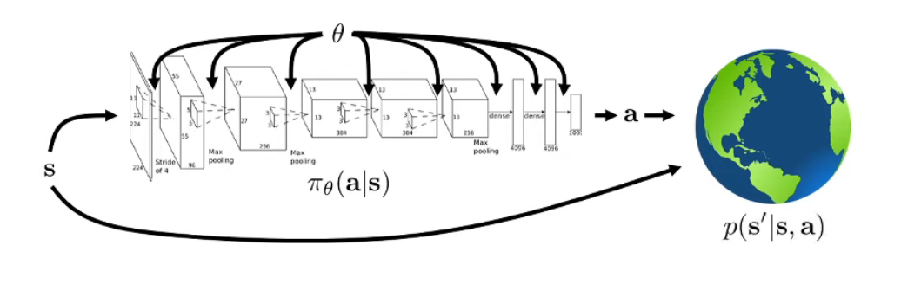
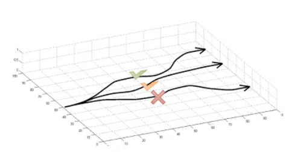
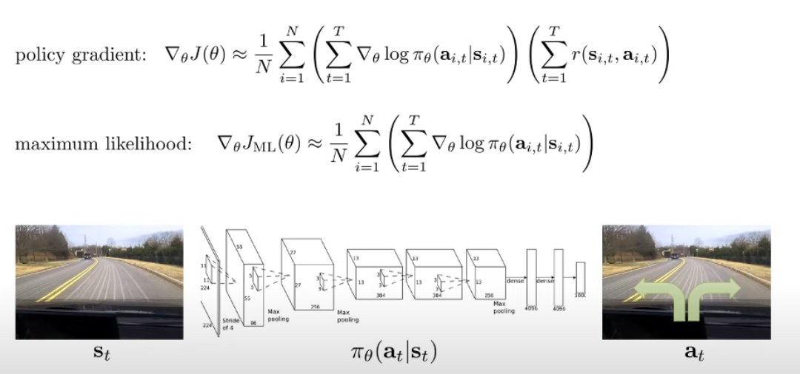
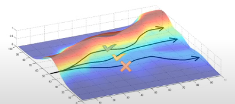
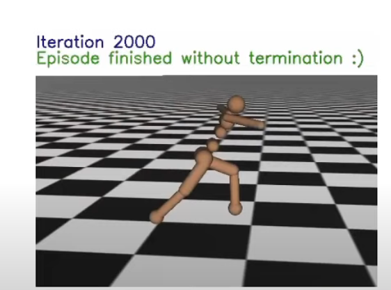
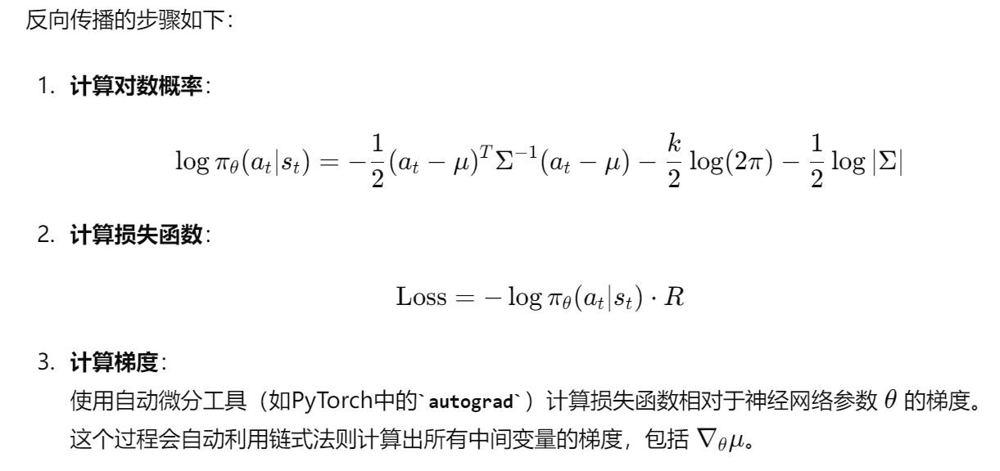
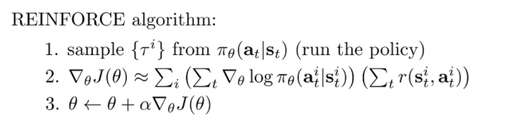
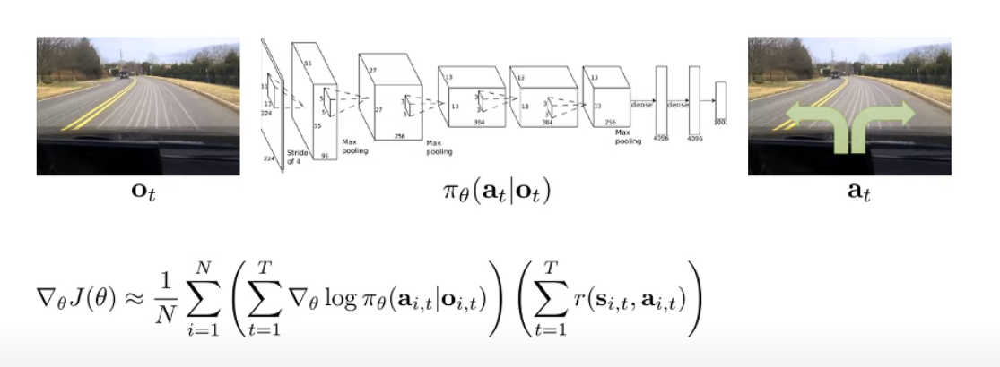
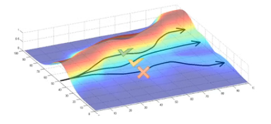

Policy Gradient可以说是最简单的RL算法，它直接对目标函数微分然后进行梯度下降。

## 1. 模型概述

考虑一个Policy $\pi$，这个policy定义了一个分布，能够在不同的状态下决定对操作的分配。

如果这个policy使用神经网络表示，那么$\theta$， policy的参数，会被神经网络权重所表示。

policy输出action之后，环境会根据状态转移概率返回状态，这个状态进入policy进行下一步的决策。

基于这个policy参数生成的**轨迹分布**我们由如下表示，即决策分布乘上概率转移分布，轨迹可以被简记为$\tau$
$$
p_\theta(\tau) = p_{\theta}(s_1,a_1,...,s_T,a_T) = p(s_1)\prod^T_{t=1}\pi_{\theta}(a_t|s_t)p(s_{t+1}|s_t,a_t)
$$

> 注意，在model free模型中，我们通常认为$p(s_1),p(s_{t+1}|s_t,a_t)$都是不可知的，我们只是假设能够与一个拥有这些分布的环境交互

我们的目的就是让当前轨迹分布下的轨迹期望奖励和最大
$$
\theta^* = \arg \max_\theta \color{blue}E_{\tau\sim p_\theta(\tau)}[\sum_t r(s_t,a_t)]
$$

> 在4.2中，我们提到了根据概率的链式法则以及马尔可夫性质，我们可以将期望奖励记为
> $$
> \color{blue} E_{\tau\sim p_\theta(\tau)}[\sum_t r(s_t,a_t)]  \color{black} = E_{s_1\sim p(s_1)}[E_{a_1\sim \pi(a_1|s_1)}[Q(s_1,a_1)|s_1]]
> $$
> 

> 这里的$Q(s_1,a_1)$代表$\color{red} 服从参数\theta的轨迹分布在s_1选取a_1到终态的期望总回报$
>
> 因此生成当前状态的最优动作可以根据$Q(s_t,a_t)$来获得
>
> 
>
> 在4.3中，我们知道了
>
> * $Q(s_t,a_t)$其实就是依据策略$\pi_\theta$​​​在轨迹上从当前步到最后能够获得的奖励总和
>   $$
>   Q^\pi(s_t,a_t) = \sum^T_{t'=t} E_{\pi_\theta}[r(s_{t'},a_{t'})|s_{t},a_{t}]
>   $$
>   此处，每个时间步的即时奖励$r(s_t,a_t)$事实上是基于前一步的状态$s_{t-1},a_{t-1}$的条件概率，但是如果写为$|s_{t'-1},a_{t'-1}$又太繁琐了，因此写为这个形式来代表"从$(s_t,a_t)$点开始往后的轨迹"。
>
>   
>
>     因此，我们可以进一步展开上面的式子
> $$
>   \color{blue} E_{\tau\sim p_\theta(\tau)}[\sum_t r(s_t,a_t)]  \color{black} = E_{s_1\sim p(s_1)}[E_{a_1\sim \pi(a_1|s_1)}[Q(s_1,a_1)|s_1]]
>     \\ = E_{(s_1,a_1)\sim p_\theta(s_1,a_1)}[\sum^T_{t=1} E_{\pi_\theta}[r(s_{t},a_{t})|s_{1},a_{1}]]
>   
>     \\ =E_{(s_1,a_1)\sim p_\theta(s_1,a_1)}[r(s_1,a_1)] + \sum^T_{t=2} E_{\pi_\theta}[r(s_{t},a_{t})|s_{1},a_{1}]
>     \\=\sum^T_{t=1} E_{(s_t,a_t)\sim p_\theta(s_t,a_t)}[r(s_t,a_t)]
> $$
>
> * 值函数就是只知道状态，考虑动作的分布，在当前状态下的期望奖励
>
> $$
> V^\pi(s_t) \\= \sum^T_{t'=t}E_{\pi_\theta}[r(s_{t'},a_{t'})|s_t]\\=E_{a_t\sim\pi(a_t|s_t)}[Q^\pi(s_t,a_t)]
> $$
>
>   

因此，我们根据如上性质可以得到轨迹期望作为目标函数在**finite horizon**中为所有步上的即时奖励期望之和（记得每一步的期望受上一步的影响）
$$
\theta^* = \arg \max_\theta \sum^T_{t=1} E_{(s_t,a_t)\sim p_\theta(s_t,a_t)}[r(s_t,a_t)]
$$

在Chapter 3中提到，对于**Infinite horizon**，因为MDP的平稳分布原理，期望和将主要由平稳分布主导，因此期望奖励就为平稳分布下的单次奖励期望最大
$$
\theta^* = \arg \max_\theta E_{(s,a)\sim p_\theta(s,a)}[r(s,a)]
$$
这里的$p_\theta (s,a)$​就是平稳分布

## 2. Evaluate the objective

### 2.1 估计目标函数

$$
\theta^* = \arg\max_{\theta} \mathbb{E}_{\tau \sim p_{\theta}(\tau)} \left[ \sum_{t} r(s_t, a_t) \right]
$$

我们简记$\mathbb{E}_{\tau \sim p_{\theta}(\tau)} \left[ \sum_{t} r(s_t, a_t) \right]$为$J(\theta)$

因此
$$
\theta^* = \arg \max_\theta J(\theta)
$$

**现在我们需要考虑，如何在不知道$p(s_1)$与$p(s_{t+1}|s_t)$的情况下估计$J(\theta)$**

 

一个直接的方法就是，在具有这个分布的环境中采样若干次取平均，就能获得期望奖励$J(\theta)$的估计值
$$
J(\theta)=\mathbb{E}_{\tau \sim p_{\theta}(\tau)} \left[ \sum_{t} r(s_t, a_t) \right] \approx \frac{1}{N}\sum_i\sum_t r(s_{i,t},a_{i,t})
$$
这里，$s_{i,t}$代表采样的第$i$个trajectory的第$t$个时间步，总共采样$N$个

如图所示，这种方法采样若干个轨迹，这些轨迹有好有坏，采样的轨迹越多，对$J(\theta)$的估计就越准确。**因为采样时遵循环境中的概率分布，因此这个方法能够有效的估计期望奖励。**

> 这里，采样得到的回报均值被认为是**期望回报的无偏估计**
>
> ## 无偏估计
>
> 无偏估计（unbiased estimator）是统计学中的一个重要概念，用来描述估计量的性质。一个估计量$\hat{\theta}$如果**其期望值$\mathbb{E}[\hat{\theta}]$等于被估计的参数值$\theta$**，则称其为无偏估计量。
> $$
> \mathbb{E}[\hat{\theta}] = \theta
> $$
> 例如，我们对均值进行无偏估计：
>
> 假设我们有一组**独立同分布**的样本$X_1,X_2,..., X_n$， 来自一个总体，其均值为$\mu$，样本均值$\bar{X}=\frac{1}{n}\sum^n_{i=1}X_i$是总体均值$\mu$的无偏估计，因为
> $$
> \mathbb{E}[\bar{X}]=\mathbb{E}\left[ \frac{1}{n}\sum^n_{i=1} X_i\right]=\frac{1}{n}\sum^n_{i=1}\mathbb{E}[X_i] = \frac{1}{n}\sum^n_{i=1}\mu = \mu
> $$
> 无偏估计在统计推断中非常重要，因为它确保了估计量在长时间内不会系统性地偏离真实值。也就是说，使用无偏估计量进行估计，在重复试验中，其平均结果会趋近于真实的参数值。
>
> ## $J(\theta)$的无偏估计
>
> 在提供的$J(\theta)$估计方法中，我们估计值的期望就是我们要求的目标值（也是一个期望）
>
> * 每次采样都是独立同分布的(iid): 每次轨迹采样之间是独立的，并且都服从同样的分布$p_\theta(\tau)$，这样，**样本均值的期望**等于**总体的均值**，就是策略的真实期望回报
> * 采样得到的回报均值是期望回报的无偏估计，因为每次采样的轨迹都是独立且根据策略 $\theta$ 产生的。对于足够大的样本数量$N$，样本均值会趋近于期望值(大数法则)
>
> 数学上来说
>
> 对于每一条轨迹，回报的综合可以表示为
> $$
> G_i = \sum_t r(s_{i,t},a_{i,t})

> $$
> 其中$G_i$是第$i$条轨迹的总回报
>
> 
>
> 平均回报的估计为
> $$
> \hat{J}{(\theta)}=\frac{1}{N}\sum^N_{i=1}G_i
> $$
> 根据大数法则，当$N$很大时，$\hat{J}(\theta)$

我们接下来使用$r(\tau)$来表示轨迹奖励和$\color{red}r(\tau) = \sum^T_{t=1}r(s_t,a_t)$
$$
J(\theta) = E_{\tau\sim p_\theta(\tau)}[r(\tau)]
$$
当然考虑到概率分布是连续的，实际计算时是对所有可能轨迹$\tau$进行加总。由于轨迹的数量通常是无穷的，因此使用积分符号来表示。
$$
J(\theta) = \int p_\theta(\tau) r(\tau)d\tau
$$

> 其中$p_\theta(\tau)$是在策略 $\theta$ 下生成轨迹 $\tau$ 的概率密度函数。它表示在策略$\theta$下，生成特定轨迹的概率.
>
> 每个轨迹的回报$r(\tau)$ 按照其在策略$\theta$ 下的概率 $p_\theta(\tau)$进行加权。这相当于计算在策略 $\theta$下，轨迹回报的期望值。

### 2.2 评估梯度

$$
\triangledown_\theta J(\theta) = \int \triangledown_\theta p_\theta(\tau)r(\tau)d\tau
$$

这里因为梯度是线性的，因此可以直接放入积分内

因此，目标就变成了$p_\theta(\tau)$的关于$\theta$的梯度

考虑到$p_\theta$其实是未知的，所以需要一些聪明的数学变换来获得。根据log的求导公式可得
$$
\triangledown_\theta p_\theta(\tau)=p_\theta(\tau)\triangledown \log p_\theta(\tau) = p_\theta(\tau)\frac{\triangledown_\theta p_\theta(\tau)}{p_\theta(\tau)}
$$
这样，原公式就变为了
$$
\triangledown_\theta J(\theta) = \int \color{red}p_\theta(\tau)\color{blue}\triangledown \log p_\theta(\tau)r(\tau)\color{black}d\tau
$$
可以发现，这里的形式变成了一个轨迹概率分布$p_\theta(\tau)$乘上一个与轨迹相关的值$\triangledown \log p_\theta(\tau)r(\tau)$，因此可以看成是这个值的期望
$$
\triangledown_\theta J(\theta) =E_{\tau\sim p_\theta(\tau)}[\triangledown \log p_\theta(\tau)r(\tau)]
$$
注意，$\color{red}我们将它转换成了期望的形式，意味着我们可以使用sample来estimate这些期望$，因此这个方向实际上是正确的

考虑这个公式中的$\triangledown \log p_\theta(\tau)$
$$
p_\theta(s_1,a_1,...,s_T,a_T)=p(s_1)\prod^T_{t=1}\pi_\theta(a_t|s_t)p(s_{t+1}|s_t,a_t)
$$

$$
\log p_\theta(\tau) = \log p(s_1) + \sum^T_{t=1}\log \pi_\theta(a_t|s_t) + \log p(s_{t+1}|s_t,a_t)
$$

因此
$$
\triangledown_\theta \log p_\theta(\tau) = 0 + \triangledown_\theta\sum^T_{t=1}\log \pi_\theta(a_t|s_t) + 0
$$
这样，$J(\theta)$就可以求得
$$
\begin{flalign}
  \triangledown_\theta J(\theta) 
&=E_{\tau\sim p_\theta(\tau)}[\triangledown \log p_\theta(\tau)r(\tau)]
\\&\color{red}= E_{\tau\sim p_\theta(\tau)}
\left[
\left( 
\sum^T_{t=1}\triangledown_\theta\log \pi_\theta(a_t|s_t)
\right)

\left(
\sum^T_{t=1}r(s_t,a_t)
\right)

\right]
\end{flalign}
$$
**现在，我们对于期望奖励$J(\theta)$中所有的参数都可以访问**

* 我们可以访问策略$\pi_\theta$: 神经网络
* 通过与环境交互，我们可以获得所有的$r(s_t,a_t)$

### 2.3 Overall Training process

根据上面的推导，我们将环境中的概率分布影响完全用采样得到的无偏估计消除，因此我们能够仅通过采样得到的若干trajectory来训练网络

1. 从环境中采样N个trajectory，获得当前策略$\pi_\theta$的无偏估计$\hat{J}(\theta)$
   $$
   J(\theta)=\mathbb{E}_{\tau \sim p_{\theta}(\tau)} \left[ \sum_{t} r(s_t, a_t) \right] \approx \hat{J}(\theta) = \frac{1}{N}\sum_i\sum_t r(s_{i,t},a_{i,t})
   $$

2. 我们证明了$\triangledown_\theta J(\theta)$只与policy $\pi_\theta$和每一步的$s_t,a_t$有关，因此我们可以**用每一步采样获得总梯度的无偏估计**
   $$
   \begin{flalign}
    \triangledown_\theta J(\theta) 
   &= E_{\tau\sim p_\theta(\tau)}
   \left[
   \left( 
   \sum^T_{t=1}\triangledown_\theta\log \pi_\theta(a_t|s_t)
   \right)
   
   \left(
   \sum^T_{t=1}r(s_t,a_t)
   \right)
   
   \right]
   
   \\
   &\approx \frac{1}{N}\sum^N_{i=1}
   \left(
   \sum^T_{t=1}\triangledown_\theta \log \pi_\theta(a_{i,t}|s_{i,t})
   \right)
   \left(
   \sum^T_{t=1}r(s_{i,t},a_{i,t})
   
   \right)
   
   \end{flalign}
   $$

3. 使用无偏估计的梯度来更新网络参数
   $$
   \theta \leftarrow \theta + \alpha\triangledown_\theta J(\theta)
   $$

### 2.4 期望奖励梯度的一个认知角度

考虑一个输入图像，输出左转右转的自动驾驶问题

在这里，$\log \pi_\theta(a_{i,t}|s_{i,t})$​​是**根据当前图像选择动作的对数概率**

在policy gradient中，目标是最大化期望奖励

在Imitation Learning中，我们的目标通常是最大化对应动作的对数概率

这两种模型都需要对所有trajectory的所有step都采样，他们的不同之处在于

* Policy gradient考虑奖励，而Imitation learning不考虑
* Policy gradient的trajectory质量层次不齐，而Imitation learning所用来训练的通常是专家动作/优质trajectory

因此Imitation Learning只会根据专家轨迹提升动作的概率，而Policy gradient会根据reward funciton 提升或降低动作的概率。

如图所示，Policy gradient会获得好的轨迹与坏的轨迹

它提升好的轨迹出现的概率，降低坏的轨迹出现的概率

> good stuff is made more likely, bad stuff is made less likely

具体来说，对于某一个trajectory的梯度
$$
\triangledown_\theta \log p_\theta(\tau) = \triangledown_\theta
\left(
\prod^T_{t=1}\pi_\theta(a_t|s_t) 
\right)

=\sum^T_{t=1}\triangledown_\theta \log \pi_\theta(a_t|s_t)
$$
更新参数时
$$
\theta \leftarrow \theta+\alpha \frac{1}{N}\sum^T_{t=1}\triangledown_\theta \log \pi_\theta(a_t|s_t)R(\tau)
$$
如果奖励是坏的，那么$\theta$就会下降，反之则会上升，这是一个较为简单的理解方向

### 连续动作下应用Policy gradient的一个例子

考虑我们想要使用策略梯度让这个小型人形机器人跑步。在这种情况下，我们需要选择一种表示 $\pi$​​​​ 的方法，使其能够输出连续值动作的分布。

首先，策略梯度定理为
$$
\begin{flalign}
 \triangledown_\theta J(\theta) 

&\approx \frac{1}{N}\sum^N_{i=1}
\left(
\sum^T_{t=1}\triangledown_\theta \log \pi_\theta(a_{i,t}|s_{i,t})
\right)
\left(
\sum^T_{t=1}r(s_{i,t},a_{i,t})

\right)

\end{flalign}
$$
要在连续动作空间中使用策略梯度，我们需要将$\pi_\theta(a_t|s_t)$表示为一个Multivariate normal distribution
$$
\pi_\theta(a_t|s_t) = \mathcal{N}(f_{neural\ network}(s_t);\Sigma)
$$
其中，均值由神经网络给出，$\Sigma$是协方差矩阵，可以是学习得到的也可以是固定的。

Multivariate Normal Distribution下的对数概率为
$$
\log \pi_\theta(a_t|s_t) = -\frac{1}{2}\Vert {f(s_t)-a_t}\Vert^2_\Sigma+const
$$
对均值参数求梯度我们就得到了
$$
\triangledown_\theta \log \pi_\theta(a_t|s_t) = -\frac{1}{2}\Sigma^{-1}(f(s_t)-a_t)\frac{df}{d\theta}
$$

> 多变量正态分布(Multivariate Normal Distribution)指的是多维空间中
>
> * 每个变量都服从正态分布
> * 变量之间存在某种相关性
>
> $$
> p(x) = \frac{1}{(2\pi)^{k/2}|\Sigma|^{1/2}}exp\left(-\frac{1}{2}(\mathbf{x}-\mu)^T\Sigma^{-1}(\mathbf{x}-\mu)\right)
> $$
>
> 其中
>
> * $\mathbf{x}$是一个$k$ 维随机向量
> * $\mu$ 是一个$k$ 维均值向量
> * $\Sigma$ 是一个$k\times k$​的协方差矩阵
> * $|\Sigma|$表示协方差矩阵的行列式
>
> 
>
> 在强化学习中，连续动作空间意味着动作$a$是一个实数值的向量，而不是离散的有限集合，需要一种方法来生成和优化这些实数值的动作。
>
> 假设我们有一个二维空间中的动作向量$\mathbf{a}=[a_1,a_2]$​，其分布为一个二维正态分布，我们可以定义其均值向量和协方差矩阵如下，
> $$
> \mu = 
> \begin{bmatrix}
> \mu_1
> \\
> \mu_2
> \end{bmatrix}
> ,
> \Sigma = 
> \begin{bmatrix}
> \sigma_{11}&\sigma_{12}\\
> \sigma_{21}&\sigma_{22}\\
> \end{bmatrix}
> $$
> 在这个例子中，$\mu$表示动作的期望，而协方差矩阵$\Sigma$​表示动作之间的相关性和方差
>
> * **中心位置**：均值向量 $\mu$ 表示分布的中心，即最有可能出现的动作值。在强化学习中，这意味着在给定状态下，策略认为最优的动作是什么。
>
> * **期望动作**：在每个状态 $s_t$ 下，均值向量 $\mu$是神经网络输出的期望动作。这个动作是策略在当前状态下执行的“默认”动作。
>
> * **调节性**：通过调整均值向量，可以改变动作分布的中心，从而影响策略的行为。均值向量的学习是策略优化的一部分，使得策略能够适应不同的环境和任务。
>
> 
>
> **在策略梯度中**，我们使用神经网络来输出动作的均值$\mu$和协方差矩阵$\Sigma$。
>
> 对于动作$a_t$，其服从Multivariate normal distribution
> $$
> p(\mathbf{a}) = \frac{1}{(2\pi)^{k/2}|\Sigma|^{1/2}}exp\left(-\frac{1}{2}(\mathbf{a}-\mu)^T\Sigma^{-1}(\mathbf{a}-\mu)\right)
> $$
> 对数概率密度为
> $$
> \log p(\mathbf{a}) = 
> \log
> \left(
> \frac{1}{(2\pi)^{k/2}|\Sigma|^{1/2}}
> \right)
> +
> \log exp
> \left(
> -\frac{1}{2}(\mathbf{a}-\mu)^T\Sigma^{-1}(\mathbf{a}-\mu)
> \right)
> $$
> 考虑这里的$log$其实是$ln$，也就是$log(exp(x))=x$
> $$
> \log p(\mathbf{a}) =\log
> \left(
> \frac{1}{(2\pi)^{k/2}|\Sigma|^{1/2}}
> \right)
> -\frac{1}{2}(\mathbf{a}-\mu)^T\Sigma^{-1}(\mathbf{a}-\mu)
> $$
> 考虑
> $$
> \log
> \left(
> \frac{1}{(2\pi)^{k/2}|\Sigma|^{1/2}}
> \right)
> =\log 1 - \log(2\pi)^{k/2}-\log|\Sigma|^{1/2}
> $$
> 因此对数概率密度可以简化为
> $$
> \log p(\mathbf{a}) = -\frac{k}{2}\log(2\pi)-\frac{1}{2}\log|\Sigma| - \frac{1}{2}(\mathbf{a}-\mu)^T\Sigma^{-1}(\mathbf{a}-\mu)
> $$
> **这里的$p(\mathbf{a})$实际上就是$\pi_\theta({\mathbf{a}_t|s_t})$**
>
> 因此，每次采样获得的$(s,a)$对获得的对数期望奖励为
> $$
> \color{red}\log \pi_\theta(a_t|s_t) =-\frac{k}{2}\log(2\pi)-\frac{1}{2}\log|\Sigma| - \frac{1}{2}(\mathbf{a}_t-\mu)^T\Sigma^{-1}(\mathbf{a}_t-\mu)
> $$
> 这意味着我们可以根据$a_t$获得$\theta$​的梯度
> $$
> \triangledown_\theta\log \pi_\theta(a_t|s_t) =\triangledown_\theta \left(
> - \frac{1}{2}(\mathbf{a}_t-\mu)^T\Sigma^{-1}(\mathbf{a}_t-\mu)
> \right)
> $$
> 注意，这里我们考虑的是$\mu$是网络输出，$\Sigma$可能是网络输出，因此网络梯度就是$\triangledown_\theta\log \pi_\theta(a_t|s_t)$对与网络相关参数的偏导，

### 策略梯度下降的一个直观理解：如何指导网络优化

好的，理解你的问题是关于策略梯度方法如何通过采样得到的回报来指导策略的优化，即使这些采样的轨迹有好有坏。这涉及到策略梯度方法的基本原理和随机性如何影响策略优化。让我们通过一个详细的例子来解释这一过程。

### 策略梯度方法的基本原理

策略梯度方法的目标是通过最大化期望累积回报 $J(\theta)$ 来优化策略参数 $\theta$。期望累积回报可以表示为：

$$
J(\theta) = \mathbb{E}_{\tau \sim p_\theta(\tau)} \left[ \sum_{t=1}^T r(s_t, a_t) \right]
$$
为了优化 $J(\theta)$，我们需要计算其梯度 $\nabla_\theta J(\theta)$：

$$
\nabla_\theta J(\theta) = \mathbb{E}_{\tau \sim p_\theta(\tau)} \left[ \sum_{t=1}^T \nabla_\theta \log \pi_\theta(a_t | s_t) \sum_{t'=t}^T r(s_{t'}, a_{t'}) \right]
$$

### 采样的轨迹如何指导策略优化

通过采样得到的轨迹（即路径 \(\tau\)），可以有好有坏，这是由环境中的概率转移决定的。然而，通过策略梯度方法，我们能够利用这些采样结果来更新策略参数，使得未来采样的轨迹更有可能产生较高的回报。以下是一个具体的例子：

#### 示例：强化学习中的路径优化

假设我们有一个简单的环境，机器人需要从起点到达终点。每一步机器人可以选择向左或向右移动，每一步都有相应的回报。我们的目标是训练机器人找到一条最高回报的路径。

1. **策略定义**：
   假设策略 $\pi_\theta$ 是由一个简单的神经网络表示，输入是机器人的当前状态（位置），输出是左右移动的概率。

2. **采样轨迹**：
   我们从当前策略 $\pi_\theta$ 中采样多个轨迹。例如，采样到的三个轨迹可能如下：
   
   - 轨迹 1: $\tau_1 = \{(s_1, a_1), (s_2, a_2), \ldots, (s_T, a_T)\}$, 回报 $R_1 = 10$
   - 轨迹 2: $\tau_2 = \{(s_1, a_1), (s_2, a_2), \ldots, (s_T, a_T)\}$, 回报 $R_2 = 5$
   - 轨迹 3: $\tau_3 = \{(s_1, a_1), (s_2, a_2), \ldots, (s_T, a_T)\}$, 回报$(R_3 = 15$

3. **计算梯度**：
   对于每条轨迹，我们计算其对数概率的梯度，并乘以相应的回报。假设轨迹的对数概率梯度为 $\nabla_\theta \log p_\theta(\tau_i)$，梯度估计为：
   $$
   \nabla_\theta J(\theta) \approx \frac{1}{3} \left( \nabla_\theta \log p_\theta(\tau_1) R_1 + \nabla_\theta \log p_\theta(\tau_2) R_2 + \nabla_\theta \log p_\theta(\tau_3) R_3 \right)
   $$
   

   这个梯度的计算其实额外包括一系列复杂的运算
   
   * 在每一步获得$s_t,a_t$对，每次前向传播都会被记录$\log \pi_\theta(a_t|s_t)$
   * 读取池中的多个$s_t,a_t$对，取累积回报
   * 计算对数概率梯度，此时因为上述操作都会列入计算图，所以最终会分摊到每一个前向传播获得的$s_t,a_t$ 对的梯度，然后对神经网络进行反向传播
   
4. **更新策略参数**：
   我们使用梯度下降更新策略参数：
   $$
   \theta \leftarrow \theta + \alpha \nabla_\theta J(\theta)
   $$

#### 为什么采样的回报能够指导策略优化

- **高回报的轨迹贡献更大**：在梯度计算中，高回报的轨迹（如轨迹 3，回报 \(R_3 = 15\)）会有更大的权重，因为其梯度被更高的回报放大。这意味着这些轨迹对策略参数的更新贡献更大，使得策略更倾向于产生类似的高回报轨迹。
  
- **低回报的轨迹贡献较小**：相反，低回报的轨迹（如轨迹 2，回报 \(R_2 = 5\)）对策略参数的更新贡献较小，甚至可能减少这些轨迹的概率。这使得策略逐渐减少选择产生低回报轨迹的动作。

- **基于概率分布进行更新**：策略梯度方法通过采样得到的轨迹估计真实的期望回报的梯度。由于我们是从当前策略的概率分布中采样轨迹，这些轨迹在一定程度上反映了策略的性能。通过梯度更新，策略参数调整方向是增加产生高回报轨迹的概率，减少产生低回报轨迹的概率。

策略梯度方法通过对轨迹回报进行加权来指导策略优化。即使轨迹有好有坏，高回报的轨迹对策略参数的更新贡献更大，从而增加高回报轨迹的概率，减少低回报轨迹的概率。通过这种方式，策略逐渐优化，能够更有效地选择产生高回报的动作序列。

## 3.REINFORCE

经典的RINFORCE算法就是上面推到的一个直接体现

## 4. 部分观察下的Policy gradient

之前我们讨论的都是状态完全可观测的情况，也就是$s_t$

现在，以视觉自动驾驶为例，其实它是一个Observation

事实上，通过上面的推导，observation也能推导出来一模一样的式子，其实是因为概率分布隐含于环境的关系。

此时，我们发现，在推导期望奖励的这一个阶段，马尔可夫性质并没有确实的被使用，

$\color{red}因此我们可以在partially\ observed\ MDP中使用policy\ gradient，一点都不用修改$

## 5. 减少Policy gradient的方差

我们之前提出的Policy gradient实际上并没有应用马尔可夫性质，甚至不符合因果假设，因此我们将在此章节添加马尔可夫假设以及因果假设。

在策略梯度方法中，我们通过采样多个轨迹来估计策略梯度 $\triangledown_\theta J(\theta)$。由于这些轨迹是从策略 $\pi_\theta$ 中随机采样的，所以估计的梯度存在随机性。这个随机性带来的变化量就是梯度估计的方差。

在强化学习中的策略梯度方法中，"variance"（方差）通常指的是估计策略梯度的不确定性或波动性。**方差越小，意味着梯度估计越稳定，从而有助于更稳定和高效的策略优化。**

* 高方差的梯度估计会导致策略参数在更新过程中出现较大波动，从而影响策略的收敛性和优化效果。较低的方差有助于梯度估计的稳定性，使得策略优化过程更加平滑和高效。
* 高方差可能导致学习过程需要更多的样本和更新步骤来达到同样的性能。较低的方差则能够提高学习效率，减少训练时间和计算资源。

因此，我们希望$\triangledown_\theta J(\theta)$​是准确和稳定的，方差越小意味着它越接近真实梯度。

> 方差通常被计算为
> $$
> Var(X) = \mathbb{E}[(X-\mathbb E(X))^2]
> $$
> 或
> $$
> Var(X) = \int^∞_{-∞}(x-\mu)^2f(x)dx
> $$
> Multivariant Normal Distribution中，方差表现为协方差矩阵
> $$
> S=\frac{1}{n-1}(X-\bar X)^T(X-\bar X)
> $$
> $\bar X $是每个特征的均值向量

### 5.1 回顾

首先回顾一下，策略梯度方法的目标是找到能最大化期望累积回报的策略参数 θ\thetaθ。期望累积回报 $J(\theta)$ 定义为：
$$
J(\theta) = \mathbb{E}_{\tau\sim p_\theta(\tau)}

\left[
\sum^T_{t=1}r(s_t,a_t)

\right]
$$
这里，$\tau$表示从初始状态到终止状态的一条轨迹，为了优化$J(\theta)$，我们需要计算其梯度$\triangledown_\theta J(\theta)$
$$
\begin{flalign}
  \triangledown_\theta J(\theta) 
&=E_{\tau\sim p_\theta(\tau)}[\triangledown \log p_\theta(\tau)r(\tau)]
\\&\color{red}= E_{\tau\sim p_\theta(\tau)}
\left[
\left( 
\sum^T_{t=1}\triangledown_\theta\log \pi_\theta(a_t|s_t)
\right)

\left(
\sum^T_{t=1}r(s_t,a_t)
\right)

\right]
\end{flalign}
$$
这里，在自然推导中（2.2），我们采用log求导公式将不可知的$\log p_\theta$转换成了可知的$\log \pi_\theta$

### 5.2 因果假设

我们细看这个公式，它其实代表了**一个轨迹的梯度和**乘上**一个轨迹的奖励和**作为当前轨迹的梯度影响力。上面的式子考虑使用sample得到无偏估计
$$
\begin{flalign}
\triangledown_\theta J(\theta)&\approx\frac{1}{N}\sum^N_{i=1}

\left(

\sum^T_{t=1}\triangledown_\theta \log \pi_\theta(a_{i,t}|s_{i,t})

\right)

\left(
\sum^T_{t=1}r(s_{i,t},a_{i,t})
\right)

\\&=
\frac{1}{N}\sum^N_{i=1}

\sum^T_{t=1}\left(\triangledown_\theta \log \pi_\theta(a_{i,t}|s_{i,t})

\left(
\sum^T_{t'=1}r(s_{i,t'},a_{i,t'})
\right)
\right)

\end{flalign}
$$

事实上，**因果假设**告诉我们,$\color{red}在时间t'时的策略不能影响时间t<t'时的reward$

原本**每一步的策略的梯度获得的奖励加权是整个轨迹的奖励加权**，

现在根据因果假设，决策步$t'$的决策不会对其之前的奖励产生影响，这意味着决策步$t'$对于所有已经发生的决策步$t$的期望为0，在sample中我们认为，之前决策步获得奖励对当前决策步梯度的贡献应该为0.

因此，考虑了因果假设的期望奖励应该为
$$
\triangledown_\theta J(\theta)\approx\frac{1}{N}\sum^N_{i=1}

\sum^T_{t=1}\left(\triangledown_\theta \log \pi_\theta(a_{i,t}|s_{i,t})

\left(
\sum^T_{t'=t}r(s_{i,t'},a_{i,t'})
\right)
\right)
$$

其中$\sum^T_{t'=t}r(s_{i,t'},a_{i,t'})$通常被称为 reward to go，指的是从当前步到最后的reward，**也有人将其记为$\hat{Q}_{i,t}$**

这样，我们就获得了一个less variance的estimator

这里为什么说减少了方差呢，因为$\triangledown_\theta J(\theta)$本身的值因为这个改动一定会变小，那么不同采样获得的震荡相比原方法一定变小。

### 5.3 Baseline

#### 5.3.1 Intuition

原本我们采样N条轨迹，梯度会为我们提高好轨迹的概率。

考虑这么一个情况，我们选择的所有轨迹都是好轨迹，只不过好的程度不一样

那么，我们的梯度就全是提升，这通常不会导向较好的结果，我们总是希望更好的轨迹拥有更高的概率。同时，采样得到全好的轨迹和采样获得全坏的轨迹这两种极端情况会导致梯度的方差很大。

很容易想到，我们可以设定一个base line，例如取轨迹奖励平均值为$b$，这样我们就能让最好的轨迹提升概率了。

$$
\triangledown_\theta J(\theta) \approx \frac{1}{N}\sum^N_{i=1} \triangledown_\theta \log p_\theta(\tau)[r(\tau)-b]
$$

#### 5.3.2 无偏估计

**那么，这么做是否会破坏无偏估计呢？**

答案是不会

因为期望的线性性质，我们可以仅仅考虑新添加进来的项的(使用log导数公式)
$$
\mathbb{E}[\triangledown_\theta \log p_\theta(\tau)b] = \int p_\theta(\tau) \triangledown_\theta \log p_\theta(\tau)b\ d\tau = \int \triangledown_\theta p_\theta(\tau)b\ d \tau = b\triangledown_\theta\int p_\theta(\tau)\ d\tau
$$
这里显然，根据归一化性质，对于所有可能的轨迹 $\tau$，它们的概率总和等于1
$$
\int p_\theta(\tau)d\tau=1
$$
因此
$$
\mathbb{E}[\triangledown_\theta \log p_\theta(\tau)b] = b\triangledown_\theta1 = b*0 = 0
$$
这意味着它不会改变梯度的期望**，满足了无偏估计**

#### 5.3.3 方差减少

**同时，梯度的方差是减少的**

同时，考虑$Var(X) = \mathbb{E}[(X-\mathbb E(X))^2]$，因为$X$本身降低了，**因此Var实际上是减少的。**

#### 5.3.4 计算最优Baseline

**并且，我们还可能计算出最优的baseline取代均值baseline**

我们首先推导一下方差，并根据方差来寻找$b$的最优值

$$
Var[x] = E[x^2]-E[x]^2
\\
\triangledown_\theta J(\theta) = E_{\tau\sim p_\theta(\tau)}[\triangledown_\theta \log p_\theta(\tau)(r(\tau)-b)]
\\
Var = E_{\tau\sim p_\theta(\tau)}[(\triangledown_\theta \log p_\theta(\tau)(r(\tau)-b))^2] - E_{\tau\sim p_\theta(\tau)}[\triangledown_\theta\log p_\theta(\tau)(r(\tau)-b)]^2
$$
这里，Var的第二项已经在5.3.2中被证明了与b无关

简记$\triangledown_\theta \log p_\theta(\tau)$为$g(\tau)$，则
$$
\begin{flalign}
\frac{dVar}{db} &= \frac{d}{db}E[g(\tau)^2(r(\tau)-b)^2]
\\
&= \frac{d}{db}
\left(
E[g(\tau)^2r(\tau)^2]  - 2E[g(\tau)^2r(\tau)b] + b^2E[g(\tau)^2]

\right)

\\
&= -2E[g(\tau)^2r(\tau)] + 2bE[g(\tau)^2]=0

\end{flalign}
$$
**注意只有标红项与b相关**

容易得到
$$
b = \frac{E[g(\tau)^2r(\tau)]}{E[g(\tau)^2]}
$$
这就是baseline的最优值。

这里可以发现，baseline取决于gradient，而gradient拥有很多参数，因此实际上就代表每个参数都决定着baseline。

同时，仔细观察上面的式子，可以发现，它实际上是用梯度加权的期望奖励取代了均值baseline。

因为计算复杂度的原因，通常均值baseline就已经足够了，通过训练量的提升能够有效的弥补baseline的不足。

