# 1. Introduction

## 1.1 什么是强化学习

以机械手学习拿取物品为例，有两种方式

* 用一个成功的数据集来直接训练机械手，

  例如用视觉图像，通过神经网络确定位置，然后训练在不同距离下的动作应该怎么做。这种方式是传统机器学习的方式，但是有一个很大的问题，即使是我们，也不能给定一个标准做法，在某个距离下去抓取物品，换句话说，我们没有数据-label集合，而且也很难有

* 让机器人自己试错，通过经验与奖励函数来学习

这两种方式代表了机器学习的两种主流做法：Supervised Learning与Unsupervised learning。

在监督学习（Supervised Learning）中，我们确实是在学习概率密度函数$p_\theta(x), p_\theta(y|x)$，它可以表示为条件概率分布或联合概率分布。例如，语言模型（如LLMs）通过大量文本数据来估计单词序列出现的概率分布。这样的模型可以帮助机器理解语言并执行各种任务，如文本分类、情感分析、机器翻译等。在监督学习中，你通常需要有一个高质量、标注良好的数据集，模型通过学习输入（x）与输出（y）之间的关系来进行预测。

对于无监督学习（Unsupervised Learning），我们不依赖于标签数据来训练模型。这类学习通常包括聚类、密度估计或者表示学习等任务，旨在发现数据中的结构或模式。无监督学习在没有明确指定输出的情况下试图理解数据，用于异常检测、主题建模和用户分群等场景。

增强学习（Reinforcement Learning）作为无监督学习的一个重要分支，其学习过程通过与环境的交互来获得。它不同于典型的无监督学习，因为它更专注于学习序列决策问题的解决方案。在增强学习中，智能体（agent）通过探索环境并从自己的经验中学习，以最大化累积回报。这种类型的学习在游戏、自动驾驶汽车、机器人控制和资源管理等方面有着广泛的应用。

## 1.2 强化学习的历史

强化学习（Reinforcement Learning，RL）的确起源于心理学领域的研究，特别是通过动物行为研究来理解如何通过反馈来塑造行为。经典的例子包括伊万·巴甫洛夫的条件反射实验，即所谓的“巴甫洛夫的狗”，在这个实验中，狗学会了在听到铃声时分泌唾液，期待食物的到来，即使食物没有出现。这种现象展示了通过反复的刺激和回报（或惩罚）可以如何影响行为，这正是强化学习算法背后的核心思想。

随着时间的推移，强化学习开始吸纳和融合更多的领域的知识，特别是从进化算法和控制优化学领域获得了显著的启发和发展。进化算法（Evolutionary Algorithms，EAs）借鉴生物进化的原理，通过迭代选择、基因重组（交叉）、变异等过程，在解空间中进行全局搜索，以期找到最优或近似最优解。这些算法启示了RL在策略搜索和优化方面的方法。

在控制理论中，尤其是在模型预测控制（Model-Predictive Control，MPC）和线性二次调节（Linear-Quadratic-Gaussian Control，LQG）等领域的研究，为强化学习提供了解决连续动作空间问题、处理噪声和不确定性等挑战的有效方法。MPC的思想，即在每一个决策点考虑未来的预测性能，并在这个预测范围内选择最优的控制动作，与强化学习中的顺序决策问题有着天然的联系。

举例来说，John Holland和他的同事在20世纪70年代提出的遗传算法，就是进化算法的经典形式之一，后来在强化学习中的策略搜索中找到了应用。另外，Karl Sims的“Evolved Virtual Creatures”项目在1990年代展示了虚拟生物通过进化和学习如何在仿真环境中移动和执行任务，为强化学习在代理体设计和行为优化方面的潜力提供了令人信服的证明。

Modern Reinforcement Learning已经不止局限于“学习”人类的行为，它更倾向于“寻找”行为的最优解。

现代强化学习（Modern Reinforcement Learning）确实已经超越了单纯模仿或学习人类行为的阶段。现在，它更多地被用于在复杂的决策空间中“寻找”最优解。AlphaGo的成功就是一个显著的例子，它通过自我对弈和深度学习算法，在围棋这一古老游戏上达到并超越了人类顶尖选手的水平。这是通过大量的模拟、评估和优化策略过程实现的，是监督学习无法直接达到的成就。

AlphaGo 的出现标志着强化学习能力的一个重要跃迁，它不再仅仅是复制现有的专家知识，而是能够通过与自己的高级版本不断对弈，探索出人类之前未知的策略和下法。这种方法突破了监督学习依赖于标记数据的限制，因为它不需要大量的标记样本来指导学习过程；相反，强化学习算法通过与环境的交互，自主发现有效的策略。

AlphaGo 之后的版本，如 AlphaGo Zero 和 AlphaZero，更是深化了这一概念，它们甚至不依赖于人类的棋局数据，完全从零开始，只依赖于游戏的规则来学习。这些系统展示了深度强化学习算法通过大规模计算和高效策略搜索的强大能力。

## 1.3 什么是强化学习2

通常分为两步

* Mathematical formalism for learning-based decision making
  * **学习型决策制定的数学形式化**： 这涉及创建数学模型来描述和优化决策过程。在这种形式化过程中，常见的模型有马尔可夫决策过程（MDP），这是一种用于随时间做出一系列决策的模型，其核心是状态（state）、动作（action）、奖励（reward）以及状态转移概率（state-transition probabilities）。在强化学习中，智能体（agent）通过与环境交互来学习策略（policy），该策略旨在最大化预期的累积奖励，通常表示为价值函数（value function）或动作价值函数（action-value function）。这些函数可以通过多种算法学习，如Q学习、时间差分学习或深度Q网络（DQN）。
* Approach for learning decision making and control from experience
  * **从经验中学习决策制定和控制**： 这种方法侧重于实际应用，其中智能体通过试错从直接的经验中学习，并在此过程中累积知识。这种学习方式不需要预先定义的规则集，而是通过不断地交互，智能体能够识别导致正面或负面结果的模式。这种学习方式在机器人学习如何导航环境或玩游戏时尤为突出。强化学习的关键组件包括探索（exploration）与利用（exploitation）的权衡，探索新的可能性与依据已知策略做出决策之间的平衡

# 2. From Supervised Learning to Decision Making

## 2.1 Supervised learning

可以写为以下形式

Given $\mathcal{D} = \{(x_i,y_i)\}$

learn to predict $\mathcal{y}$ from $x$	$f(x) \approx y$​

> $input: x$
>
> $output: y$
>
> $data: \mathcal{D} = \{(x_i,y_i)\}$​
>
> $goal: f_\theta(x_i) \approx y_i$

Usually assume:

* Independent & identical distribution(独立同分布) data
  * `i.i.d`假设是指用于训练模型的样本是独立的，并且是从同一个概率分布中抽取的。
  * **独立性**（Independence）：每个样本的获取不受其他样本的影响。在实践中，这意味着每个样本的出现都是一个独立事件，没有任何相关性。
  * **同分布**（Identically Distributed）：所有样本都来自相同的分布，这意味着数据集中的每个样本都应当反映出这个分布的特性。即每个样本都代表了总体分布的性质。

就如第一章中所说的，Supervised Learning需要一个true label y用来训练，这个东西有的时候我们并不能获得。

## 2.2 Reinforcement learning

* Data is not `i.i.d`：因为之前的输出会影响未来的输入（决策链)
* Ground truth answer is not known(true label is not known), only known if we succeed or failed(or known what is the value)

在强化学习中，一次决策链获得的succeed与failed结果并不代表这个决策链所有的决策都是正确或是失败的，需要注意这一点。

$input: s_t\ at\ each\ time\ step$

$output: a_t\ at\ each\ time\ step$​

$data:(s_1, a_1,r_1,...,s_T,a_T,r_T)$:need pick ur own action instead of been given data

$goal: learn\ \pi_\theta\ :s_t \rightarrow a_t\ to\ maximize\ \sum_t r_t$

> 
>
> 在强化学习中，延时奖励（Delayed Reward）是指当前的行动可能会在未来某个时间步产生影响，好的或者坏的结果可能不会立即显现，因为行动的结果可能有时间延迟。例如，在股市交易中，当天的投资决策可能要几个月甚至几年后才能看到显著的经济回报。在RL中，智能体必须能够从这种延时反馈中学习，评估长远后果，并据此制定策略。
>
> 强化学习算法必须能够处理这种延时奖励问题，它们通过一种称为信用分配（credit assignment）的过程来完成这一任务。信用分配的挑战在于确定过去的哪些行动对当前的奖励贡献最大，从而在未来做出更好的决策。
>
> 延时奖励的概念在规划和决策方面具有重要意义，它强调了考虑长期目标和影响的重要性，而不仅仅是短期利益。

## 2.3 二者的区别

Data without optimization doesn't allow us to solve new problems in new ways.

## 2.4 Sutton说的Learning and search

learning: use data to extract patterns

search: use computation to extract inferences

search is not about getting more data, search is about using what u get more interesting/meaningful conclusion

learning help u understand the world, search 帮你利用这种理解来产生有趣的行为

> 深度强化学习试图做的事情涵盖了学习和搜索两个方面：
>
> - **学习（Learning）**：通过使用数据来提取模式，深度强化学习利用来自环境的数据来理解决策过程中应该关注的模式。这一步是通过神经网络等机器学习模型来完成，模型能够识别和学习这些模式，并将其转化为知识。
> - **搜索（Search）**：搜索则更多关注于使用计算来提取推理。在深度强化学习中，搜索通常涉及到优化过程，这个过程使用迭代计算来做出理性的决策。搜索不是关于获取更多的数据，而是关于使用你所获得的数据得出更有意义的结论。
>
> 学习使我们理解世界，搜索则利用这种理解来产生有趣的行为或“出现”（emergence）。这种行为可能包括新策略的发现，或者在复杂环境中导航的能力。在许多情况下，学习和搜索是相互结合的，学习提供了行为的基础，而搜索则探索如何在这基础上优化和适应。

Data without optimization doesn't allow us to solve new problem in new ways

Optimization without data is hard to apply to the real world outside of simulators

## 2.5 什么是策略

策略其实就是传统深度学习中的模型。

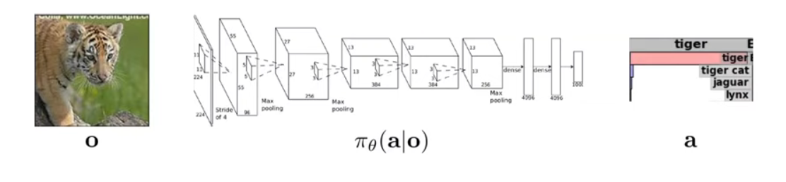

以图像深度学习为例，它实际上就是拟合了一个策略来进行选择。

在强化学习中，我们使用$\pi _\theta$，其中$\pi$表示Policy，而$\theta$表示该策略的参数。

对于决策模型，它通常是一个序列决策，这也意味着其带有类似时间的属性，因此如果类比为图像，他可能会变为这个老虎之后会做什么。但是实际上这并不会改变我们训练策略的方式。

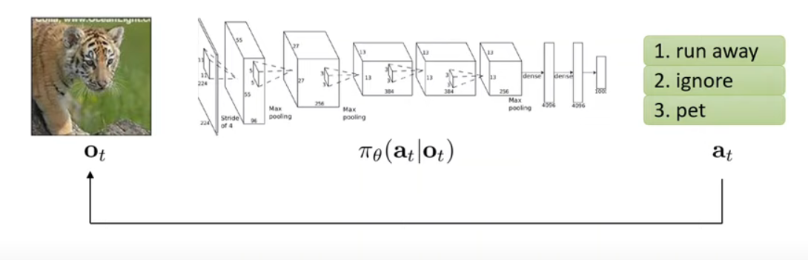

当然，如果考虑连续的动作，那么我们只需要撤掉softmax即可。

$s_t: state$

$o_t:observation$

$a_t: action$

$\pi_\theta(a_t|o_t):policy$

$\pi_\theta(a_t|s_t):policy(fully\ observed)$

注意，策略是一个分布，这意味着它为所有可能采取的行动给定了一个特定的观察。

可以发现，上面出现了两种policy的形式，一种是基于observation的policy，一种是基于state的policy。

observation可以看作是一个图片，它拥有一个像素数组，来代表这个图片拥有什么信息。

state产生了这个observation，state应该是对某一个目标的一个简明完整的物理描述。

observation有时可能包含了你推断state所需的所有要素，但是有时也会误导你的推断。

例如，上一秒的observation可能是一只猎豹，下一秒的observation却是一辆路过的车。我们知道猎豹的state是不变的，它可能还在奔跑，但是observation却可能会误导我们猎豹瞬移了。

因此，$o_t \rightarrow s_t$通常是不太保险的

$s_t \rightarrow o_t$通常是正确的

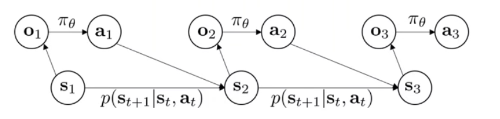

强化学习的决策序列可以看作一个状态转移的概率模型，其由多个$p(s_{t+1}|s_t,a_t)$组成，这代表在当前$s_t$执行$a_t$时转移到下一个状态$s_{t+1}$的概率。

注意，这里我们认为，$S_3$是条件独立于$S_1$的。

If u know the state $S_2$ and you need to figure out the state $S_3$, then $S_1$ doesn't give you any additional information, which means $S_3$ is conditionally dependent of $S_1$ given $S_2$​

这就是所谓的马尔可夫性质。如果你知道现在的状态，那么过去的状态对你来说并不重要，因为你知道关于当前状态在这个世界中的一切。马尔可夫假设直接规定了`state captures everything u need to know to predict the future without knowing the past`。这不是意味着未来完全可预测（因为未来可能是一个概率分布的转移），但是这意味着了解过去对你预测未来没有帮助。

这实际上是十分合理的，虽然它假设你知道这个世界的规则。以计算机模拟为例，计算机知道规则，它只需要当前的状态数值就能计算出下一个状态。

接下来讨论的很多模型都被描述为只能学习那些基于state的policy，$\pi_\theta(a_t|s_t):policy(fully\ observed)$​,即他们需要policy的输入满足马尔可夫性质，以fully encode the entire cellular system。

而另一些模型被设计为十分乐意对部分观察(observation)进行操作，即使他们不足以推断状态。

## 2.6 Imitation Learning

### 问题模型

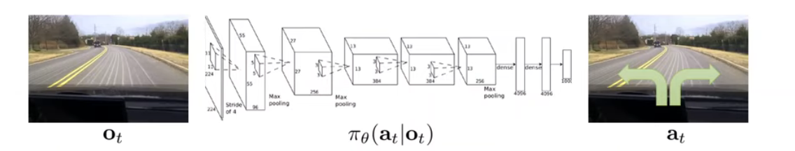

我们的目标是使用supervised learning学习一个基于observation上分布的策略。

以自动驾驶为例，我们的输入是当前observation，动作是左转或者右转

通常来说，训练过程是让一个人类来开车，然后图像与每次方向盘转动的角度被加入training data。此时$o_t$为输入， $a_t$为label。接下来过程与传统深度学习一致。这种方式通常被称为$Behavior\ cloning$​

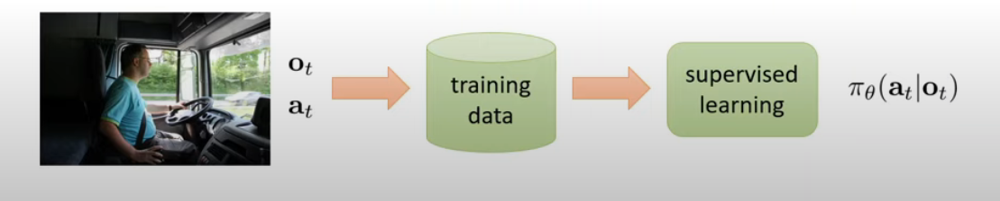

### **Does it work?**

NO

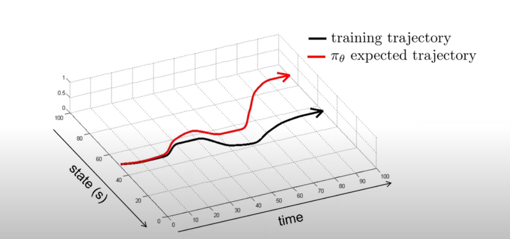

首先，所有的拟合都是会出现细微的扰动的，也就是不可能完全拟合，这点随便拟合一个曲线都能发现。

对于强化学习，考虑同一条路，如果你这次拟合出现的些微偏差，例如本来要稍微右转一些，模型选择了直行，那么下一个observation就会看到有一些陌生的observation，继而可能做出另一个错误决策。这些错误决策的累积会最终导致结果的极大偏差。

我们在supervised learning中并不会发现这种问题，这是源于supervised learning中的IID假设。在传统监督学习中，我们假设每个训练点不会影响其他训练点。这意味着对于observation1输出的label1与observation2输出的label2没有任何联系。但是在这里，你选择的操作会改变你在下一个时间步中观察到的，因此它违反了这个假设。

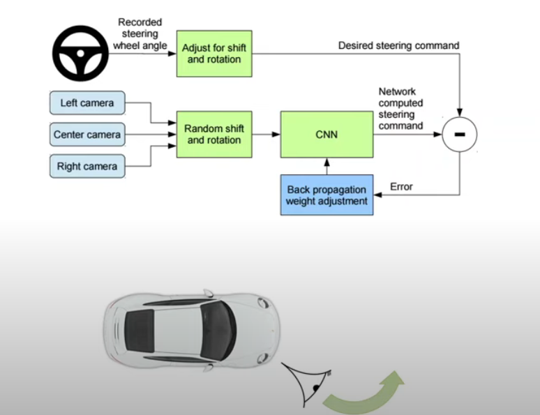

实际上，现实中Nvidia的自动驾驶使用Imitation的效果并没有想象中的那么糟糕。这是因为他们呢首先采集了大量数据，这使得能够看起来陌生的图片变得很少。其次，他们使用了三摄像机的构造。中间摄像机就作为训练使用，左右摄像机拥有固定的label：左或者右。

当我们发生上述偏移时，例如本该右转，模型选择了直行，此时车的位姿偏左，主camera获得了偏左的observation，这个observation实际上并没有那么陌生，因为它被左camera标记为左了，因此车只需要向右打方向即可。

我们可以发现，通过人为的设置boundary，实际上能够获得不错的效果，但是仍然不能应对极端情况。

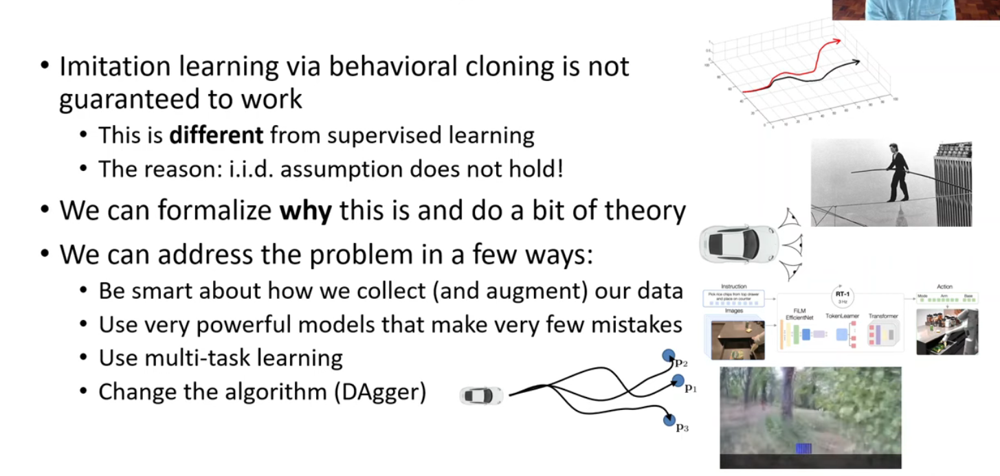

### **Theory: Why behavioral cloning fail?**

之前提到过，behavioral cloning失败的主要原因是错误累积。

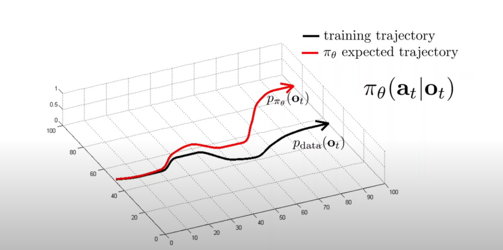

它使用了supervised learning来拟合一个输入数据集，这个输入数据集实际上具有一个特定的分布，这个分布就是开车的人本身的开车决策（习惯）。标记为
$$
p_{data}(o_t)
$$
我们用一个新的distribution来代表我们训练好的模型的分布
$$
p_{\pi_{\theta}}(o_t)
$$
显然$p_{\pi_{\theta}}(o_t)$不会与$p_{data}(o_t)$​​​完全相同。

#### **Distributional shift**

> 考虑我们使用supervised maximum likelihood or empirical risk minimization, 训练过程就是如下
>
> train under $p_{data}(o_t)$
> $$
> \max_\theta E_{o_t \sim p_{data}(o_t)}[\log {\pi_{\theta}(a_t|o_t)}]
> $$
> 这里trainning中的observation是从$p_{data}(o_t)$中采样的
>
> 考虑到我们在监督学习中训练时不期望overfit，也不期望underfit，因此我们仅期望正确的行动具有high probability。
>
> 这个现象来自于**分布偏移（distributional shift）**。这个概念描述了一个场景，其中一个算法或模型在训练期间使用的数据分布和它在实际部署或测试期间遇到的数据分布不一致。这种不一致可能导致模型的性能下降，因为模型是为了优化和适应训练数据的特定分布而设计的。
>
> - **训练分布（$p_{data}$）**：这是模型在训练过程中观察到的数据分布，通常由专家或已有的数据集定义。这个分布反映了模型期望在实际操作中遇到的情况。
> - **测试分布（$p_{\pi_\theta}$）**：这是模型在实际运行或测试时遇到的数据分布。这个分布是由模型的策略 $\pi_\theta$​ 决定的，意味着它是模型自身行为的结果。
>
> 一个模型或策略的性能并不是由它在训练分布下好行为的对数概率决定的，而是由它在实际运行时（即测试分布下）好行为的对数概率决定的。由于训练和测试分布可能不同，模型在训练时学到的行为在实际应用中可能不再适用。这就是为什么即使在训练数据上表现良好的模型，在现实世界应用时也可能失败。
>
> 分布偏移常常是因为模型在实际应用中犯错导致的。==模型可能会在某些未曾训练过的数据或情况下作出不良决策，从而生成与训练时不同的数据分布。==这种由模型决策引起的分布偏移在实践中是非常具有挑战性的，因为它可能导致模型性能迅速恶化。
>
> 在实际应用中，如果未能正确处理分布偏移的问题，即使模型在训练集上的评估指标优异，也可能在新的、实际的数据分布上表现不佳。因此，开发具有泛化能力强的模型，能够适应或者识别不同的数据分布，是机器学习中的一个重要研究方向。
>
> 很容易构造出反例来显示当分布偏移存在时，模型可能的失败。这些反例有助于开发者理解和评估模型在面对现实世界复杂数据时的真实表现，从而更好地调整和设计模型以应对分布偏移。

### 如何让behavioral cloning 有效：几个动态系统的分析

#### 抛弃似然性目标

我们首先要定义我们到底如何精准的评判我们的策略是好还是坏。Imitation learning采用的是==训练模型使得最大化在训练行为上的似然性==。这明显不是我们希望的方法，因为模型可以将人类驾驶员在当前状态的动作设置为最高的可能性，然后在很相似的状态上采取了完全错误的行为。因此我们需要一个更好的measure of goodness使得我们可以用来评判我们的策略。

> 一个好的策略不应只是在训练时见过的状态下表现良好，而应当在新的或略有差异的状态下仍然能作出正确的行为决策。简单地模仿人类驾驶员在训练数据中的行为可能导致策略在实际应用中遇到未见过的情况时失败。

为了更精确地衡量和分析策略的效果，引入一个消耗函数cost function，这个函数基于状态和行动来定义，具体如下：

- **成本为零**：如果策略采取的行动与人类驾驶员在相同状态下会采取的行动一致。
- **成本为一**：如果策略采取的行动与人类驾驶员的行动不一致。

通过这样定义，可以将策略犯错的情况直接量化为成本，从而使得总成本等于策略犯的错误数。这种成本设置简单明了，便于量化和优化策略的性能。

你可以认为，cost function就是将这个优化问题的原本的优化目标变为了鲁棒优化目标。

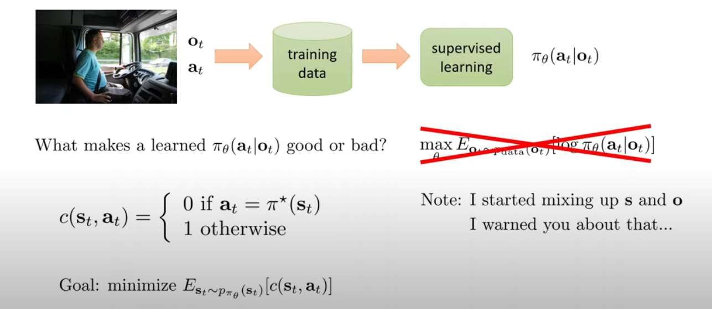

我们的目标变为了最小化策略犯错次数，注意这里是在训练的模型上$p_{\pi_\theta}$​

#### cost目标的表现：基于特定已知有限数据集

那么这个鲁棒优化目标的效果怎么样？

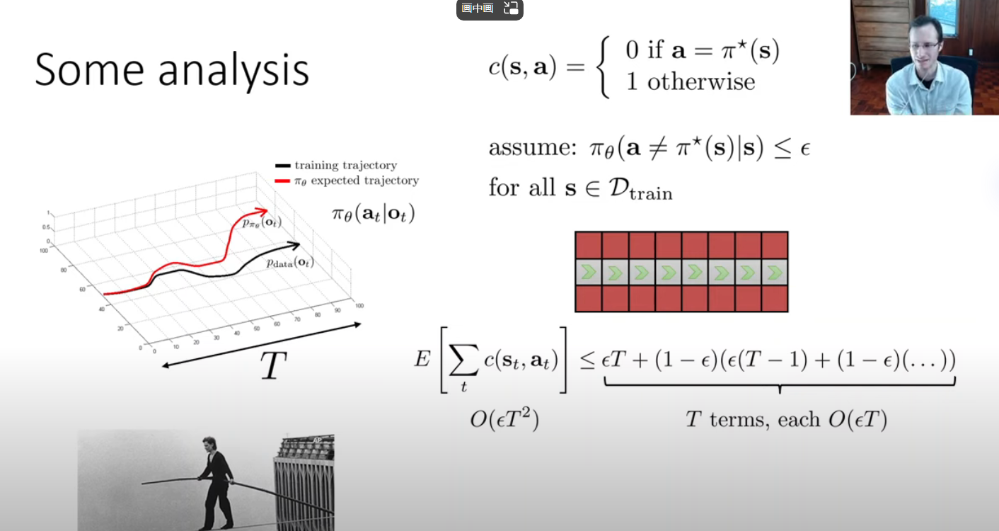

在上图中，成本函数$c(s,a)$被定义为当学习策略$\pi_\theta$采取的动作a与专家策略相同时为0，不同时为1.

然后，我们假设$\pi_\theta(a\neq\pi^*(s)|s)\leq \epsilon$，即为在训练数据的状态空间$D_{train}$中，学习策略$\pi_\theta$采取与专家$\pi^*$不同动作的概率不超过$\epsilon$​。

> 当说 $s∈D_{train}$，意味着我们在讨论一个特定的，已知的训练数据集中的状态。这个状态集合是有限的，并且每个状态可能都与一个专家动作相关联。对于这些具体状态，我们可以假设学习策略$\pi_\theta$在这些已知状态上采取不同于专家策略$\pi^*$的动作的概率小于或等于 ϵ。这是一个针对特定状态的概率限制。

因此，期望代价$E[\sum_t c(s_t, a_t)]$的上界被给出为如下几个子项之和

* 第一步就走错，因此我们认为他后面所有步数都会走错，因为state是陌生的：$\epsilon T$

* 第一步走对了，同理开始分析第二步及以后

  $(1-\epsilon)(\epsilon(T-1) + (1-\epsilon)(...))$

这里的T代表策略的执行步数，展开后很容易能发现，级数中的每一项都是$O(\epsilon T)$，同时一共有T项，因此是$O(\epsilon T^2)$的复杂度，==这意味着我们的决策链越长，我们的cost期望以平方增长，这意味着我们犯错误的可能越大。==

#### cost目标的表现：general analysis

上面的分析中我们认为所有的state都来自于特定的状态集Training Set

$s\in D_{train}$

实际上，在大多数情况下，我们的state是抽样训练数据分布得到的状态

$s \sim p_{train}(s)$

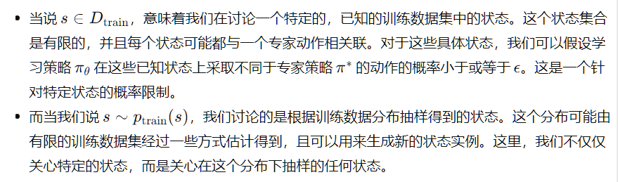

鉴于此，当我们将条件概率$\pi_\theta(a\neq\pi^*(s)|s)\leq \epsilon$结合在整个训练**分布**$p_{train}$下时，我们得到一个期望$E_{p_{train}(s)}[\pi_\theta(a \neq \pi^*(s)|s)]\leq \epsilon$。这意味着对于从训练分布中抽取的任何状态$s$，在平均意义上，学习策略$\pi_\theta$采取不同于专家策略的动作的概率不会超过$\epsilon$

我们用策略状态分布$p_\theta(s_t)$来描述随时间$t$​变化的状态分布。

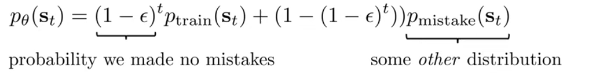

在$p_{train}(s) \neq p_\theta(s)$的情况下，实际上$p_\theta(s_t)$可以使用两部分表示

* 正确动作的部分：
  *  $(1-\epsilon)^t p_{train}(s_t)$
  * $(1-\epsilon)^t$是策略在每个时间步$t$都采取正确动作（即为与专家策略一致)的概率。随着时间推移，连续做出正确决策的概率呈指数级衰减。
* 错误动作的部分
  * $(1-(1-\epsilon)^t)p_{mistake}(s_t)$​
  * $(1-(1-\epsilon)^t)$是**至少在一步中做出错误动作**的累积概率。如果我们在一个或者多个时间步犯了错，状态就会转移到$p_{mistake}$分布

这个公式反映了随着时间推移，由于策略犯错，状态分布从原始的训练分布 $p_{train}$ 向由错误导致的分布 $p_{mistake}$ 过渡的动态过程。

注意，这里的$p_{mistake}$是十分复杂的一个情况，因此我们不会对$p_{mistake}$​做出任何假设。

当$\epsilon$很小时，正确动作部分就会占据主导。

此时，我们可以用一个简单的形式来代表分布之间的发散(divergence),对于任意t，都有
$$
|p_\theta(s_t) - p_{train}(s_t)| = (1-(1-\epsilon)^t)|p_{mistake}(s_t) - p_{train}(s_t)|
$$

首先我们阐明，两个概率分布的差实际上

How to make it work more often and can we develop better algorithms that a litter smarter than just straight up using supervised learning?

# 3. Model-free algorithms: Q-learning,Policy gradients, actor-critic

# 4. Exploration

# 5. Offline reinforcement learning

# 6. Inverse reinforcement learning

# 7. Advanced topics

