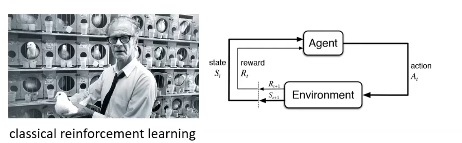
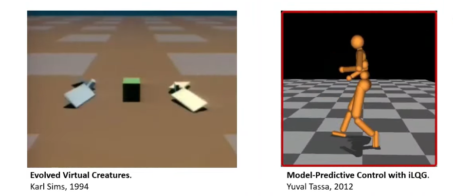
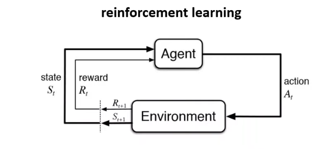
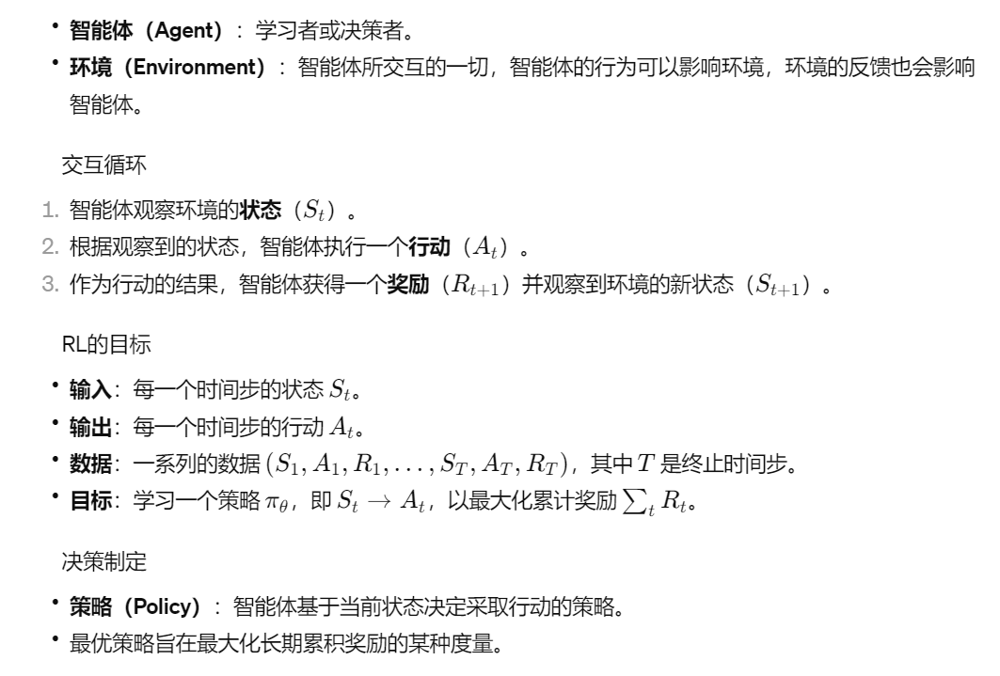
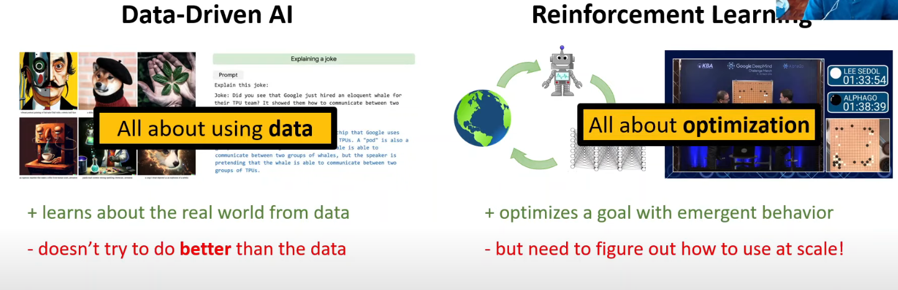
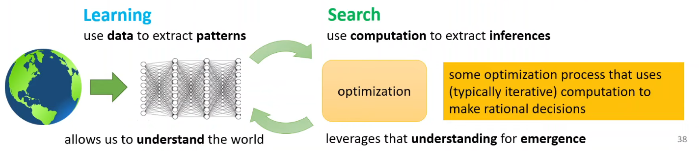

# 1. Introduction

## 1.1 什么是强化学习

以机械手学习拿取物品为例，有两种方式

* 用一个成功的数据集来直接训练机械手，

  例如用视觉图像，通过神经网络确定位置，然后训练在不同距离下的动作应该怎么做。这种方式是传统机器学习的方式，但是有一个很大的问题，即使是我们，也不能给定一个标准做法，在某个距离下去抓取物品，换句话说，我们没有数据-label集合，而且也很难有

* 让机器人自己试错，通过经验与奖励函数来学习

这两种方式代表了机器学习的两种主流做法：Supervised Learning与Unsupervised learning。

在监督学习（Supervised Learning）中，我们确实是在学习概率密度函数$p_\theta(x), p_\theta(y|x)$，它可以表示为条件概率分布或联合概率分布。例如，语言模型（如LLMs）通过大量文本数据来估计单词序列出现的概率分布。这样的模型可以帮助机器理解语言并执行各种任务，如文本分类、情感分析、机器翻译等。在监督学习中，你通常需要有一个高质量、标注良好的数据集，模型通过学习输入（x）与输出（y）之间的关系来进行预测。

对于无监督学习（Unsupervised Learning），我们不依赖于标签数据来训练模型。这类学习通常包括聚类、密度估计或者表示学习等任务，旨在发现数据中的结构或模式。无监督学习在没有明确指定输出的情况下试图理解数据，用于异常检测、主题建模和用户分群等场景。

增强学习（Reinforcement Learning）作为无监督学习的一个重要分支，其学习过程通过与环境的交互来获得。它不同于典型的无监督学习，因为它更专注于学习序列决策问题的解决方案。在增强学习中，智能体（agent）通过探索环境并从自己的经验中学习，以最大化累积回报。这种类型的学习在游戏、自动驾驶汽车、机器人控制和资源管理等方面有着广泛的应用。

## 1.2 强化学习的历史

强化学习（Reinforcement Learning，RL）的确起源于心理学领域的研究，特别是通过动物行为研究来理解如何通过反馈来塑造行为。经典的例子包括伊万·巴甫洛夫的条件反射实验，即所谓的“巴甫洛夫的狗”，在这个实验中，狗学会了在听到铃声时分泌唾液，期待食物的到来，即使食物没有出现。这种现象展示了通过反复的刺激和回报（或惩罚）可以如何影响行为，这正是强化学习算法背后的核心思想。

随着时间的推移，强化学习开始吸纳和融合更多的领域的知识，特别是从进化算法和控制优化学领域获得了显著的启发和发展。进化算法（Evolutionary Algorithms，EAs）借鉴生物进化的原理，通过迭代选择、基因重组（交叉）、变异等过程，在解空间中进行全局搜索，以期找到最优或近似最优解。这些算法启示了RL在策略搜索和优化方面的方法。

在控制理论中，尤其是在模型预测控制（Model-Predictive Control，MPC）和线性二次调节（Linear-Quadratic-Gaussian Control，LQG）等领域的研究，为强化学习提供了解决连续动作空间问题、处理噪声和不确定性等挑战的有效方法。MPC的思想，即在每一个决策点考虑未来的预测性能，并在这个预测范围内选择最优的控制动作，与强化学习中的顺序决策问题有着天然的联系。

举例来说，John Holland和他的同事在20世纪70年代提出的遗传算法，就是进化算法的经典形式之一，后来在强化学习中的策略搜索中找到了应用。另外，Karl Sims的“Evolved Virtual Creatures”项目在1990年代展示了虚拟生物通过进化和学习如何在仿真环境中移动和执行任务，为强化学习在代理体设计和行为优化方面的潜力提供了令人信服的证明。

Modern Reinforcement Learning已经不止局限于“学习”人类的行为，它更倾向于“寻找”行为的最优解。

现代强化学习（Modern Reinforcement Learning）确实已经超越了单纯模仿或学习人类行为的阶段。现在，它更多地被用于在复杂的决策空间中“寻找”最优解。AlphaGo的成功就是一个显著的例子，它通过自我对弈和深度学习算法，在围棋这一古老游戏上达到并超越了人类顶尖选手的水平。这是通过大量的模拟、评估和优化策略过程实现的，是监督学习无法直接达到的成就。

AlphaGo 的出现标志着强化学习能力的一个重要跃迁，它不再仅仅是复制现有的专家知识，而是能够通过与自己的高级版本不断对弈，探索出人类之前未知的策略和下法。这种方法突破了监督学习依赖于标记数据的限制，因为它不需要大量的标记样本来指导学习过程；相反，强化学习算法通过与环境的交互，自主发现有效的策略。

AlphaGo 之后的版本，如 AlphaGo Zero 和 AlphaZero，更是深化了这一概念，它们甚至不依赖于人类的棋局数据，完全从零开始，只依赖于游戏的规则来学习。这些系统展示了深度强化学习算法通过大规模计算和高效策略搜索的强大能力。

## 1.3 什么是强化学习2

通常分为两步

* Mathematical formalism for learning-based decision making
  * **学习型决策制定的数学形式化**： 这涉及创建数学模型来描述和优化决策过程。在这种形式化过程中，常见的模型有马尔可夫决策过程（MDP），这是一种用于随时间做出一系列决策的模型，其核心是状态（state）、动作（action）、奖励（reward）以及状态转移概率（state-transition probabilities）。在强化学习中，智能体（agent）通过与环境交互来学习策略（policy），该策略旨在最大化预期的累积奖励，通常表示为价值函数（value function）或动作价值函数（action-value function）。这些函数可以通过多种算法学习，如Q学习、时间差分学习或深度Q网络（DQN）。
* Approach for learning decision making and control from experience
  * **从经验中学习决策制定和控制**： 这种方法侧重于实际应用，其中智能体通过试错从直接的经验中学习，并在此过程中累积知识。这种学习方式不需要预先定义的规则集，而是通过不断地交互，智能体能够识别导致正面或负面结果的模式。这种学习方式在机器人学习如何导航环境或玩游戏时尤为突出。强化学习的关键组件包括探索（exploration）与利用（exploitation）的权衡，探索新的可能性与依据已知策略做出决策之间的平衡

# 2. From Supervised Learning to Decision Making

## 2.1 Supervised learning

可以写为以下形式

Given $\mathcal{D} = \{(x_i,y_i)\}$

learn to predict $\mathcal{y}$ from $x$	$f(x) \approx y$​

> $input: x$
>
> $output: y$
>
> $data: \mathcal{D} = \{(x_i,y_i)\}$​
>
> $goal: f_\theta(x_i) \approx y_i$

Usually assume:

* Independent & identical distribution(独立同分布) data
  * `i.i.d`假设是指用于训练模型的样本是独立的，并且是从同一个概率分布中抽取的。
  * **独立性**（Independence）：每个样本的获取不受其他样本的影响。在实践中，这意味着每个样本的出现都是一个独立事件，没有任何相关性。
  * **同分布**（Identically Distributed）：所有样本都来自相同的分布，这意味着数据集中的每个样本都应当反映出这个分布的特性。即每个样本都代表了总体分布的性质。

就如第一章中所说的，Supervised Learning需要一个true label y用来训练，这个东西有的时候我们并不能获得。

## 2.2 Reinforcement learning

* Data is not `i.i.d`：因为之前的输出会影响未来的输入（决策链)
* Ground truth answer is not known(true label is not known), only known if we succeed or failed(or known what is the value)

在强化学习中，一次决策链获得的succeed与failed结果并不代表这个决策链所有的决策都是正确或是失败的，需要注意这一点。

$input: s_t\ at\ each\ time\ step$

$output: a_t\ at\ each\ time\ step$​

$data:(s_1, a_1,r_1,...,s_T,a_T,r_T)$:need pick ur own action instead of been given data

$goal: learn\ \pi_\theta\ :s_t \rightarrow a_t\ to\ maximize\ \sum_t r_t$

> 
>
> 在强化学习中，延时奖励（Delayed Reward）是指当前的行动可能会在未来某个时间步产生影响，好的或者坏的结果可能不会立即显现，因为行动的结果可能有时间延迟。例如，在股市交易中，当天的投资决策可能要几个月甚至几年后才能看到显著的经济回报。在RL中，智能体必须能够从这种延时反馈中学习，评估长远后果，并据此制定策略。
>
> 强化学习算法必须能够处理这种延时奖励问题，它们通过一种称为信用分配（credit assignment）的过程来完成这一任务。信用分配的挑战在于确定过去的哪些行动对当前的奖励贡献最大，从而在未来做出更好的决策。
>
> 延时奖励的概念在规划和决策方面具有重要意义，它强调了考虑长期目标和影响的重要性，而不仅仅是短期利益。

## 2.3 二者的区别

Data without optimization doesn't allow us to solve new problems in new ways.

## 2.4 Sutton说的Learning and search

learning: use data to extract patterns

search: use computation to extract inferences

search is not about getting more data, search is about using what u get more interesting/meaningful conclusion

learning help u understand the world, search 帮你利用这种理解来产生有趣的行为

> 深度强化学习试图做的事情涵盖了学习和搜索两个方面：
>
> - **学习（Learning）**：通过使用数据来提取模式，深度强化学习利用来自环境的数据来理解决策过程中应该关注的模式。这一步是通过神经网络等机器学习模型来完成，模型能够识别和学习这些模式，并将其转化为知识。
> - **搜索（Search）**：搜索则更多关注于使用计算来提取推理。在深度强化学习中，搜索通常涉及到优化过程，这个过程使用迭代计算来做出理性的决策。搜索不是关于获取更多的数据，而是关于使用你所获得的数据得出更有意义的结论。
>
> 学习使我们理解世界，搜索则利用这种理解来产生有趣的行为或“出现”（emergence）。这种行为可能包括新策略的发现，或者在复杂环境中导航的能力。在许多情况下，学习和搜索是相互结合的，学习提供了行为的基础，而搜索则探索如何在这基础上优化和适应。

Data without optimization doesn't allow us to solve new problem in new ways

Optimization without data is hard to apply to the real world outside of simulators

# 3. Model-free algorithms: Q-learning,Policy gradients, actor-critic

# 4. Exploration

# 5. Offline reinforcement learning

# 6. Inverse reinforcement learning

# 7. Advanced topics

